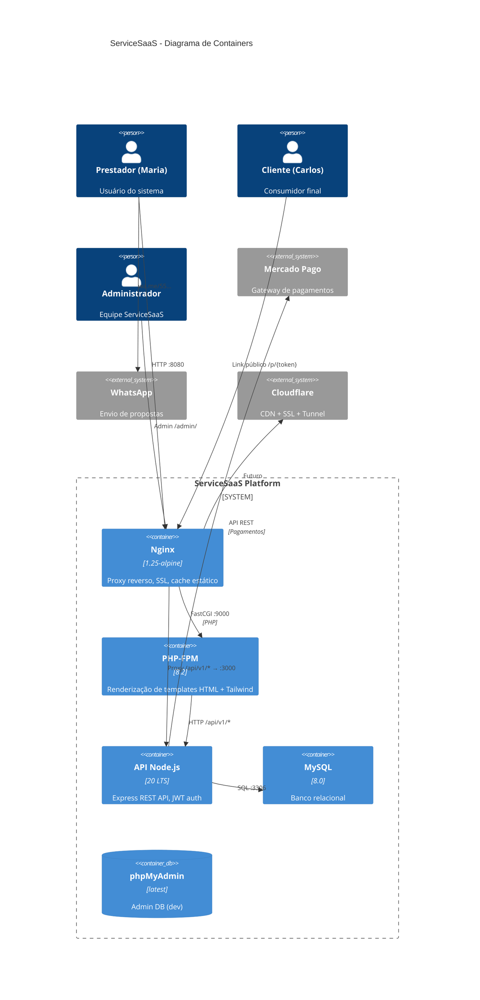

# 🏛️ ServiceSaaS — Arquitetura Detalhada

**Documentado por:** Paige (Technical Writer)
**Data:** 28 de Julho de 2026

---

## 1. Stack e Versões

| Camada | Tecnologia | Versão | Função |
|:---|---|:---:|:---|
| **Frontend** | PHP + HTML5/Tailwind | 8.2 | Renderização de templates |
| **API** | Node.js + Express.js | 20 LTS | REST API |
| **Database** | MySQL | 8.0 | Persistência relacional |
| **Proxy** | Nginx | 1.25-alpine | Reverse proxy + cache |
| **Container** | Docker Compose | 3.8+ | Orquestração |
| **Exposição** | Cloudflare Tunnel | — | Futuro |

---

## 2. Diagrama de Containers



---

## 3. Middlewares (API Node.js)

### 3.1. Pipeline de Requisição

```
Request → [requestId] → [rateLimiter] → [auth*] → [tenant*] → [controller] → [errorHandler]
```

- `requestId`: Gera UUID v4, injeta `X-Request-ID` no response
- `rateLimiter`: 100 req/min por IP (express-rate-limit)
- `auth`: Opcional nas rotas públicas, obrigatório nas privadas
- `tenant`: Injeta `tenant_id = req.user.tenant_id` em toda query

### 3.2. Detalhamento dos Middlewares

| Middleware | Arquivo | Função | Escopo |
|:---|---|:---|:---:|
| **Request ID** | `requestId.middleware.js` | Correlation ID (UUID) para tracing | Global |
| **Auth** | `auth.middleware.js` | Valida JWT via `Authorization: Bearer` | Rotas protegidas |
| **Tenant** | `tenant.middleware.js` | Isola dados por `tenant_id` em queries | Rotas protegidas |
| **Error** | `error.middleware.js` | Captura exceções, retorna JSON padronizado | Global |
| **Admin** | `admin/admin.middleware.js` | Verifica role `super_admin` | Rotas admin |

---

## 4. Rotas da API

### 4.1. Rotas Públicas

| Método | Rota | Controller | Descrição |
|:---:|---|---|:---|
| POST | `/api/v1/auth/register` | auth | Cadastro PF/PJ |
| POST | `/api/v1/auth/login` | auth | Login |
| POST | `/api/v1/auth/forgot-password` | auth | Solicitar recuperação |
| POST | `/api/v1/auth/reset-password` | auth | Redefinir senha |

### 4.2. Rotas Protegidas (Auth + Tenant)

| Método | Rota | Controller | Descrição |
|:---:|---|---|:---|
| GET | `/api/v1/clients` | clients | Listar clientes (paginado) |
| POST | `/api/v1/clients` | clients | Criar cliente |
| GET | `/api/v1/clients/:id` | clients | Ler cliente |
| PUT | `/api/v1/clients/:id` | clients | Atualizar cliente |
| DELETE | `/api/v1/clients/:id` | clients | Excluir (lógico) |
| GET | `/api/v1/categories` | catalog | Listar categorias |
| POST | `/api/v1/categories` | catalog | Criar categoria |
| PUT | `/api/v1/categories/:id` | catalog | Editar categoria |
| DELETE | `/api/v1/categories/:id` | catalog | Excluir categoria |
| GET | `/api/v1/services` | catalog | Listar serviços |
| POST | `/api/v1/services` | catalog | Criar serviço |
| PUT | `/api/v1/services/:id` | catalog | Editar serviço |
| DELETE | `/api/v1/services/:id` | catalog | Excluir serviço |
| GET | `/api/v1/proposals` | proposals | Listar propostas |
| POST | `/api/v1/proposals` | proposals | Criar proposta + itens |
| GET | `/api/v1/proposals/:id` | proposals | Ler proposta + itens |
| PUT | `/api/v1/proposals/:id` | proposals | Editar proposta |
| DELETE | `/api/v1/proposals/:id` | proposals | Cancelar proposta |
| PATCH | `/api/v1/proposals/:id/status` | proposals | Transição de status |
| GET | `/api/v1/proposals/:id/items` | proposals | Listar itens |
| POST | `/api/v1/proposals/:id/items` | proposals | Adicionar item |
| PUT | `/api/v1/proposals/:id/items/:itemId` | proposals | Editar item |
| DELETE | `/api/v1/proposals/:id/items/:itemId` | proposals | Remover item |
| GET | `/api/v1/dashboard` | dashboard | KPIs agregados |

### 4.3. Rotas Admin (Auth + super_admin)

| Método | Rota | Controller | Descrição |
|:---:|---|---|:---|
| GET | `/api/v1/admin/dashboard` | admin | KPIs globais |
| GET | `/api/v1/admin/tenants` | admin | Listar tenants |
| GET | `/api/v1/admin/tenants/:id` | admin | Detalhes do tenant |

---

## 5. Tabela de Rotas do Frontend

| Rota | Template | Descrição | Auth |
|:---:|:---|---|:---:|
| `/` | `home.php` | Landing Page | ❌ |
| `?page=login` | `login.php` | Login | ❌ |
| `?page=register` | `register.php` | Cadastro | ❌ |
| `?page=forgot-password` | `forgot-password.php` | Recuperar senha | ❌ |
| `?page=reset-password` | `reset-password.php` | Redefinir senha | ❌ |
| `?page=dashboard` | `dashboard.php` | Dashboard | ✅ |
| `?page=clients` | `clients.php` | CRUD Clientes | ✅ |
| `?page=categories` | `categories.php` | CRUD Categorias | ✅ |
| `?page=services` | `services.php` | CRUD Serviços | ✅ |
| `?page=proposals` | `proposals.php` | CRUD Propostas | ✅ |

---

## 6. Decisões Arquiteturais (ADRs)

### ⚠️ Gap Crítico: Tabela `transactions`

A tabela `transactions` é referenciada em:
- `admin.controller.js` — `SELECT COALESCE(SUM(amount), 0) as total FROM transactions WHERE status = 'completed'`
- `tenant.middleware.js` — incluída na lista de tabelas com `tenant_id`

**A tabela NÃO EXISTE no `init.sql`.** Consulte o schema recomendado na [Pesquisa Técnica MP](research/technical-mercado-pago-integration-research.md), seção 7.3.

| ADR | Decisão | Status |
|:---:|:---|---|
| AD-1 | JWT no header `Authorization: Bearer`, armazenado em `$_SESSION['jwt']` no PHP | ✅ Implementado |
| AD-2 | Multi-tenancy com `tenant_id` injetado via middleware em toda query | ✅ Implementado |
| AD-3 | Endpoint agregado `GET /api/v1/dashboard` para KPIs | ✅ Implementado |
| AD-4 | Persistência atômica de proposta + itens em transação MySQL | ✅ Implementado |
| AD-5 | Idempotência de pagamentos via `X-Idempotency-Key` | 📝 Planejado (Epic 5) |
| AD-6 | Geração de PDF via pdfkit | 📝 Planejado (Epic 3) |
| AD-7 | Cache Nginx para assets estáticos | ✅ Implementado |
| AD-8 | Exclusão lógica: `active=false` para clients/products | ✅ Implementado |

---

## 7. NFRs Arquiteturais

| NFR | Descrição | Status |
|:---:|:---|---|
| NFR-07 | Prepared Statements (mysql2 `?`) | ✅ |
| NFR-08 | Output escaping (htmlspecialchars) | ✅ |
| NFR-09 | Rate limiting (express-rate-limit) | ✅ |
| NFR-10 | bcrypt + JWT 24h | ✅ |
| NFR-15 | Multi-tenancy isolation | ✅ |
| NFR-16 | Structured logging (JSON) | ✅ |
| NFR-18 | Correlation ID (X-Request-ID) | ✅ |
| NFR-26 | Docker Compose multi-container | ✅ |
| NFR-27 | Responsividade (Desktop/Tablet/Mobile) | ✅ |
| NFR-28 a 31 | Acessibilidade (teclado, screen reader, contraste, touch) | ✅ |

---

*Documento gerado por Paige (Technical Writer) em 28 de Julho de 2026*
