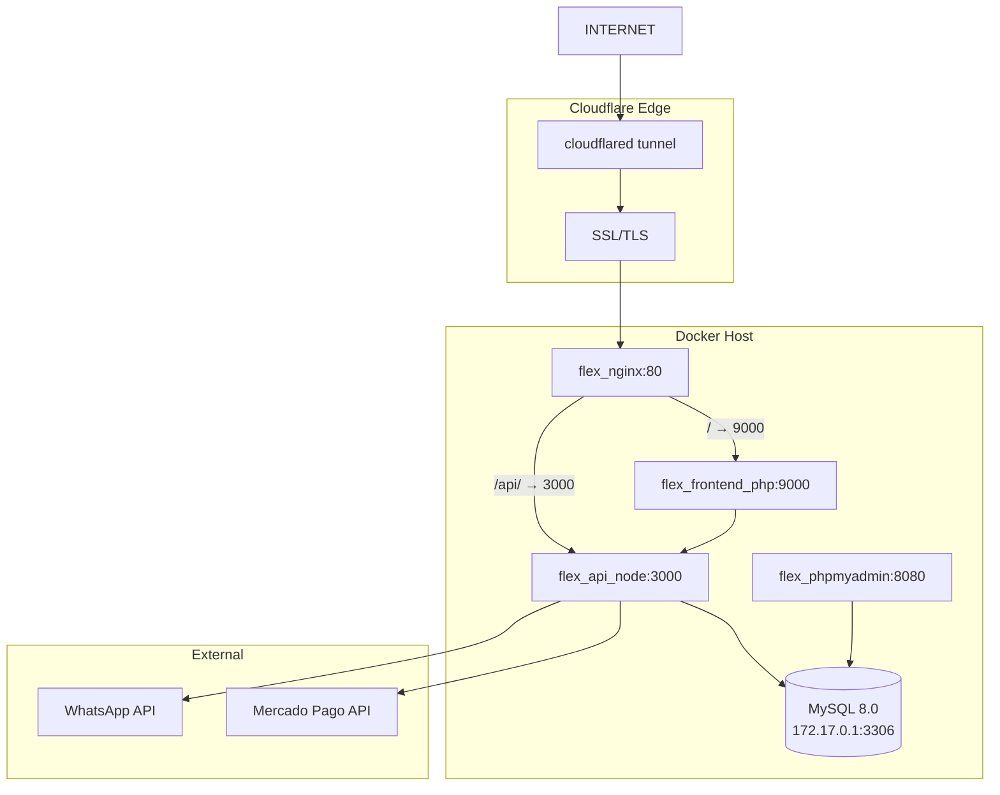
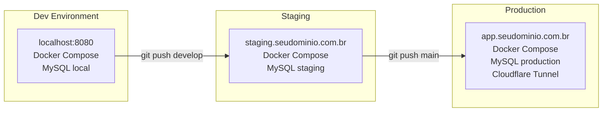

# Architecture Spine — ServiceSaaS (Serviços Flex)

## Design Paradigm

**Layered architecture** with **modular-by-domain** internal structure. Three physical tiers (PHP frontend → Node.js API → MySQL), with the API layer decomposed into vertical slices (modules) by business domain. Each slice owns its routes, controller, service, and data access — no cross-module direct calls.

```
┌──────────────────────────────────────────────────┐
│                 🖥️ PRESENTATION                  │
│          PHP-FPM 8.2 · HTML/CSS/JS               │
│  Landing · Dashboard · Forms · Templates         │
│          │  HTTP (cURL/Guzzle)                   │
│          ▼                                       │
├──────────────────────────────────────────────────┤
│                 ⚙️ API (Node.js 20)              │
│  ┌──────┐ ┌───────┐ ┌──────┐ ┌──────┐ ┌────────┐ │
│  │ Auth │ │Clients│ │ Prods│ │ Props│ │Payments│ │
│  └──────┘ └───────┘ └──────┘ └──────┘ └────────┘ │
│          │  mysql2 connection pool               │
│          ▼                                       │
├──────────────────────────────────────────────────┤
│                 🗄️ DATA                          │
│               MySQL 8.0 · utf8mb4                │
│     8 tables · FK constraints · 6 indices        │
└──────────────────────────────────────────────────┘
```

## Invariants & Rules

### AD-1 — JWT as sole auth truth

- **Binds:** All authenticated endpoints
- **Prevents:** Session state duplicated across PHP and Node.js
- **Rule:** JWT via `Authorization: Bearer <token>` header is the single source of truth. The PHP frontend stores the JWT in `$_SESSION['jwt']` after login and passes it to the Node.js API on every request that needs auth via the `Authorization` header. Token `maxAge`: 24h; no refresh-token in MVP (user re-logs-in on expiry).
- **Status:** [ADOPTED] per ADR-005 finding → JWT-only

### AD-2 — Multi-tenancy by tenant_id injection

- **Binds:** All data-access paths (every SQL query, every service method)
- **Prevents:** Data leakage between tenants
- **Rule:** The `tenant.middleware.js` extracts `tenant_id` from the JWT payload and injects it into `req.tenantId`. EVERY SQL query in every module MUST include `WHERE tenant_id = ?` (or equivalent). No query ever runs without a tenant_id filter. The middleware rejects requests that attempt to pass a different tenant_id in params/body.
- **Status:** [ADOPTED] per PRD and security analysis

### AD-3 — Aggregated API for frontend

- **Binds:** Dashboard and multi-KPI pages
- **Prevents:** N sequential HTTP calls between PHP and Node.js degrading page load time
- **Rule:** Any page that displays 2+ independent data points (e.g., KPIs + chart + follow-up list) MUST use a single aggregated endpoint. Implement `GET /api/v1/dashboard/summary` that returns `{ kpis, chart_data, follow_ups }` in one response. The reverse-proxy Nginx may cache this endpoint for 30s (stale-while-revalidate).
- **Status:** [ADOPTED] per ADR-009

### AD-4 — Atomic proposal persistence (mestre-detalhe)

- **Binds:** `POST /api/v1/proposals`
- **Prevents:** Partial saves where proposal header exists but items are missing or inconsistent
- **Rule:** The proposals.create endpoint receives a single JSON payload containing both header (`client_id, notes`) and items (`[{product_id, description, quantity, unit_price}]`). The service wraps the insert in a MySQL transaction — header first, then items. `ROLLBACK` if ANY item fails. The frontend JS assembles the full payload in-memory before POSTing.
- **Status:** [ADOPTED] per PRD v2.0

### AD-5 — Mercado Pago idempotent payments

- **Binds:** All POST requests to Mercado Pago API
- **Prevents:** Duplicate charges due to network retries
- **Rule:** Every POST to Mercado Pago carries `X-Idempotency-Key: <UUID>`. Webhooks validate the payment by re-fetching `GET /v1/payments/{id}` before updating status. The `transactions.mp_payment_id` column has a UNIQUE constraint.
- **Status:** [ADOPTED] per Integration spec (Seção 9)

### AD-6 — PDF generation via pdfkit in API layer

- **Binds:** `GET /api/v1/proposals/:id/pdf`
- **Prevents:** Heavy Puppeteer dependency consuming Docker memory
- **Rule:** Use `pdfkit` Node.js library (native, no browser). Template rendering uses simple coordinate-based layout. Logo and branding loaded from tenant config. No HTML-to-PDF conversion.
- **Status:** [ADOPTED] per ADR-008

### AD-7 — Cache Nginx for static assets, no Redis in MVP

- **Binds:** Static file delivery, dashboard summary endpoint
- **Prevents:** Unnecessary compute on repeated requests
- **Rule:** Nginx serves static assets (CSS, JS, images) directly with `Cache-Control: public, max-age=31536000, immutable`. Dashboard summary endpoint cached by Nginx for 30s. Redis or in-memory data cache deferred to v1.1.
- **Status:** [ADOPTED] per ADR-009

### AD-8 — Logical deletes with status tracking

- **Binds:** `clients`, `products_services`, `proposals`
- **Prevents:** Irreversible data loss
- **Rule:** DELETE operations set `active = false` for `clients` and `products_services` tables (which have `active BOOLEAN` column). For `proposals`, set `status = 'cancelled'` (the ENUM does NOT include a 'deleted' value — 'cancelled' is the terminal logical-delete state). Hard deletes are NEVER performed on user data. Deleted/cancelled records remain in the database with timestamps. A background job (monthly) may anonymize personal data per LGPD policy.
- **Status:** [ADOPTED] per PRD

### AD-9 — Workers as distinct entity from clients

- **Binds:** All worker-related endpoints, scheduling, time tracking
- **Prevents:** Mixing worker (prestador) and client (tomador) concepts in same table
- **Rule:** Workers MUST live in a separate `workers` table with CPF UNIQUE, CBO code, worker_category ENUM (9 domestic categories), background_check_status, and certifications in a child `worker_certifications` table. Never reuse the `clients` table for workers.
- **Status:** [ADOPTED] per ADR-010

### AD-10 — Frequency-lock algorithm (diarista limit)

- **Binds:** `POST /api/v1/schedules`, `POST /api/v1/proposals`
- **Prevents:** 3+ weekly bookings of same worker by same client without CLT transition
- **Rule:** BEFORE creating any schedule/proposal with regime=AUTONOMO_DIARISTA, the service MUST count existing schedules for the same worker CPF + client CPF pair in the current ISO week (Mon-Sun). If count >= 2, BLOCK the operation and return `ERR_FREQUENCY_LIMIT` with a `transition_url` pointing to the CLT onboarding flow. The frequency-lock is the ONLY gate that triggers the CLT flow.
- **Status:** [ADOPTED] per ADR-011

### AD-11 — Geolocated time tracking with photo evidence

- **Binds:** `POST /api/v1/timetracking/clock-in`, `POST /api/v1/timetracking/clock-out`
- **Prevents:** Fraudulent time records without location or photo proof
- **Rule:** Clock-in and clock-out MUST capture GPS coordinates (`lat`, `lng`) and a photo (via mobile app or webcam). Store coordinates in `time_tracking` columns. Upload photo to S3/R2 storage — never to local disk. Each event is idempotent (one clock-in per schedule per day). The calculated `total_regular_minutes` plus `total_overtime_minutes` must match the day's shift.
- **Status:** [ADOPTED] per ADR-012

### AD-12 — Async eSocial processing via job queue

- **Binds:** `POST /api/v1/esocial/admission`, `POST /api/v1/esocial/termination`, DAE generation
- **Prevents:** HTTP request timeout on long-running eSocial API calls
- **Rule:** eSocial operations (admission, termination, DAE generation) MUST be dispatched to a BullMQ job queue backed by Redis. The endpoint returns `202 Accepted` immediately with a `job_id`. A worker process consumes the queue, calls eSocial API, updates `esocial_integration` status, and notifies the user on completion. Never perform eSocial operations synchronously in the request-response cycle.
- **Status:** [ADOPTED] per ADR-013 + ADR-014

### AD-13 — Mandatory certification per worker category

- **Binds:** Worker activation, schedule creation for sensitive categories
- **Prevents:** Unqualified workers being assigned to high-risk roles (elderly care, childcare)
- **Rule:** Workers with category `CUIDADOR_IDOSOS` or `BABA` MUST have at least one verified certification of the matching type in `worker_certifications` before they can be scheduled. The `worker_certifications.verified` boolean MUST be `true`. Other categories (DIARISTA, JARDINEIRO) have no certification requirement. The certification checker runs at schedule creation time and returns `ERR_CERTIFICATION_REQUIRED` if unmet.
- **Status:** [ADOPTED] per ADR-015

### AD-14 — Incident reporting with emergency escalation

- **Binds:** `POST /api/v1/incidents`, `POST /api/v1/incidents/:id/sos`
- **Prevents:** Delayed emergency response and lack of incident audit trail
- **Rule:** Every incident report MUST capture `incident_type`, `severity`, `occurred_at`, `reported_by`, and `description`. Critical incidents (severity=CRITICAL) trigger automatic push notification to the tenant and the platform admin team within 15 minutes. SOS button sends geolocation to pre-registered emergency contacts. CAT (Comunicação de Acidente de Trabalho) emission is an async job via BullMQ.
- **Status:** [ADOPTED] per ADR-016

### AD-15 — Tenant address for proximity search

- **Binds:** `tenants` table, `POST /auth/register`, `GET /api/v1/public/services`, `PUT /api/v1/tenants/me`
- **Prevents:** Inability for clients to find nearby service providers
- **Rule:** Every tenant MUST register at minimum `city` and `state` at signup. The public services search endpoint (`GET /api/v1/public/services`) supports an optional `?city=` query parameter that filters services by the provider's registered city. The tenant profile endpoint (`PUT /api/v1/tenants/me`) allows updating address fields. Without city/state, the tenant's services are not discoverable via location search but remain visible in unfiltered results.
- **Status:** [ADOPTED] per auditoria compliance — GAP crítico corrigido

## Consistency Conventions

| Concern | Convention |
| --- | --- |
| **Naming — API routes** | `/api/v1/{module}/{action}` — plural resources (e.g., `/api/v1/clients`, `/api/v1/proposals/:id`) |
| **Naming — DB tables** | snake_case, plural: `tenants`, `users`, `clients`, `products_services`, `proposals`, `proposal_items`, `public_leads`, `transactions` |
| **Naming — JS files** | kebab-case: `auth.middleware.js`, `payments.service.js`, `mercadopago.js` |
| **Naming — PHP files** | snake_case: `api_client.php`, `proposta_form.php` |
| **IDs** | DB: `INT AUTO_INCREMENT`. Public proposal tokens: UUID v4 (36 chars). Proposal numbers: `OS-{year}-{sequential}` |
| **Dates** | Storage: `TIMESTAMP` in MySQL (UTC). Display: `dd/mm/YYYY` in PHP/JS (localized) |
| **Currency** | Storage: `DECIMAL(10,2)`. Display: `R$ 0.000,00` with JS locale formatting |
| **Error format** | JSON: `{ error: string, code: string, details?: any }`. HTTP status codes follow RFC 7231 |
| **API versioning** | URL prefix `/api/v1/`. Breaking changes → `/api/v2/` |
| **Logging** | JSON-structured, output to stdout. Container runtime (Docker) collects via `docker compose logs` |

## Stack

| Name | Version | Purpose |
| --- | --- | --- |
| PHP | 8.2 | Frontend rendering |
| Node.js | 20 LTS | API runtime |
| Express.js | 4.19 | HTTP framework |
| MySQL | 8.0 | Database |
| Nginx | 1.25-alpine | Reverse proxy + cache |
| Docker Compose | 3.8+ | Container orchestration |
| Cloudflare Tunnel (cloudflared) | 2024.6.1 | Secure web exposure |
| Mercado Pago SDK JS | 4.0 | Payment gateway (frontend) |
| Mercado Pago SDK Node | 2.1 | Payment gateway (backend) |
| pdfkit | 0.15.0 | PDF generation |
| Chart.js | 4.4 | Dashboard charts |
| mysql2 | 3.10 | Node.js MySQL driver |
| jsonwebtoken | 9.0 | JWT auth |
| bcrypt | 5.1 | Password hashing |

## Structural Seed

### System Context



### Deployment Architecture



### Source Tree (Key Modules Only)

```
servicos-flex/
├── web-frontend/public/           # PHP presentation layer
│   ├── index.php                  # Landing Page
│   ├── login.php / register.php   # Auth (consumes API)
│   ├── dashboard.php              # KPI dashboard
│   ├── clientes.php               # Client CRUD
│   ├── produtos_servicos.php      # Catalog CRUD
│   ├── propostas.php              # Proposal list
│   ├── proposta_form.php          # Mestre-detalhe form
│   ├── proposta_publica.php       # Public proposal view
│   ├── financeiro.php             # Payment history
│   └── configuracoes.php          # Tenant settings
│
├── api-backend/modules/           # Node.js API — vertical slices
│   ├── auth/                      # Login, register, JWT
│   ├── tenants/                   # Tenant profile (address, settings)
│   ├── clients/                   # CRUD
│   ├── products/                  # Catalog CRUD
│   ├── proposals/                 # Mestre-detalhe + PDF
│   ├── dashboard/                 # Aggregated KPIs
│   ├── payments/                  # Mercado Pago + webhook
│   └── public/                    # Landing Page search/leads
│
├── nginx/default.conf             # Reverse proxy
└── docker-compose.yml             # 5 services (nginx, php, api, pma, tunnel)
```

## Capability → Architecture Map

| Capability / Area | Lives in | Governed by |
| --- | --- | --- |
| **FR-001–005** (Auth) | `api-backend/modules/auth/` + `web-frontend/public/{login,register}.php` | AD-1 (JWT), AD-2 (tenancy) |
| **FR-010–014** (Clients) | `api-backend/modules/clients/` + `web-frontend/public/clientes.php` | AD-2 (tenancy), AD-8 (logical delete) |
| **FR-020–022** (Products) | `api-backend/modules/products/` + `web-frontend/public/produtos_servicos.php` | AD-2 (tenancy), AD-8 (logical delete) |
| **FR-030–035** (Proposals) | `api-backend/modules/proposals/` + `web-frontend/public/propostas*.php` | AD-4 (atomic), AD-6 (PDF) |
| **FR-040–043** (Dashboard) | `api-backend/modules/dashboard/` + `web-frontend/public/dashboard.php` | AD-3 (aggregated) |
| **FR-050–053** (Payments) | `api-backend/modules/payments/` + `web-frontend/public/financeiro.php` | AD-5 (idempotency) |
| Landing Page + Leads | `api-backend/modules/public/` + `web-frontend/public/index.php` | — |
| WhatsApp integration | `api-backend/services/whatsappService.js` | — |
| **Domestic Workers (new)** | `api-backend/modules/domestic/` + `web-frontend/templates/workers.php` | AD-9 (Workers), AD-10 (Frequency), AD-13 (Certification) |
| **Time Tracking (new)** | `api-backend/modules/timetracking/` | AD-11 (Geolocated clock) |
| **eSocial (new)** | `api-backend/modules/esocial/` | AD-12 (Async queue) |
| **Incidents (new)** | `api-backend/modules/incidents/` | AD-14 (Emergency escalation) |
| **Tenant Profile (new)** | `api-backend/modules/tenants/` + `web-frontend/templates/tenant-profile.php` | AD-15 (Proximity search) |

## Deferred

| Decision | Reason It Can Wait |
| --- | --- |
| **Redis / in-memory cache** | MVP traffic (< 50 tenants) doesn't warrant it. AD-3 (aggregated endpoint) + Nginx cache sufficient. Revisit at > 200 tenants. **Exception:** Redis IS required for the eSocial async job queue (AD-14) — deploy alongside Fase 9. |
| **Refresh tokens / token rotation** | 24h session expiry acceptable for MVP. Revisit if user complaints about re-login frequency. |
| **Database read replicas** | Single MySQL instance sufficient for MVP. Add read replica at > 500 concurrent users. |
| **Horizontal scaling / load balancer** | Docker Compose single-host sufficient. Migrate to Docker Swarm or K8s at > 1000 tenants. |
| **CDN for static assets** | Cloudflare CDN used automatically (proxied DNS). No additional config needed. |
| **Full-text search** | MySQL `LIKE` queries sufficient for MVP. Migrate to Elasticsearch or Meilisearch for > 10k products. |
| **OpenAPI/Swagger documentation** | API small (< 15 endpoints) — code-as-documentation sufficient. Add OpenAPI at v2.0 for public API. |
| **CI/CD self-hosted runners** | GitHub Actions free tier (2000 min/month) sufficient for MVP traffic. |
| **Automated E2E tests** | Manual testing + Jest unit tests sufficient for MVP. Add Playwright E2E at v1.1. |
| **Real-time dashboard updates (WebSockets)** | WhatsApp + email notifications sufficient for autonomous module. For domestic time tracking, polling (30s) is adequate. Full WebSockets deferred to v2.0. |

---

*Generated following the BMad Architecture methodology. Decisions verified against current versions on npm/npmjs as of 2026-07-27.*

---
