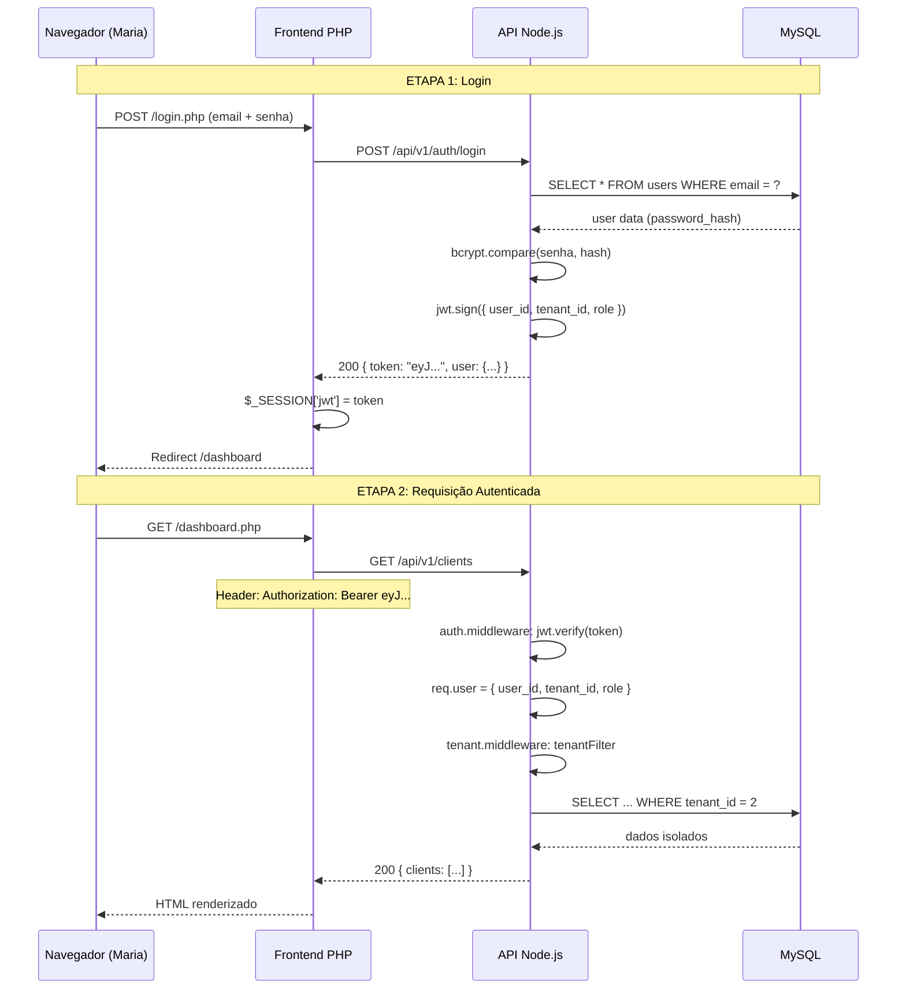
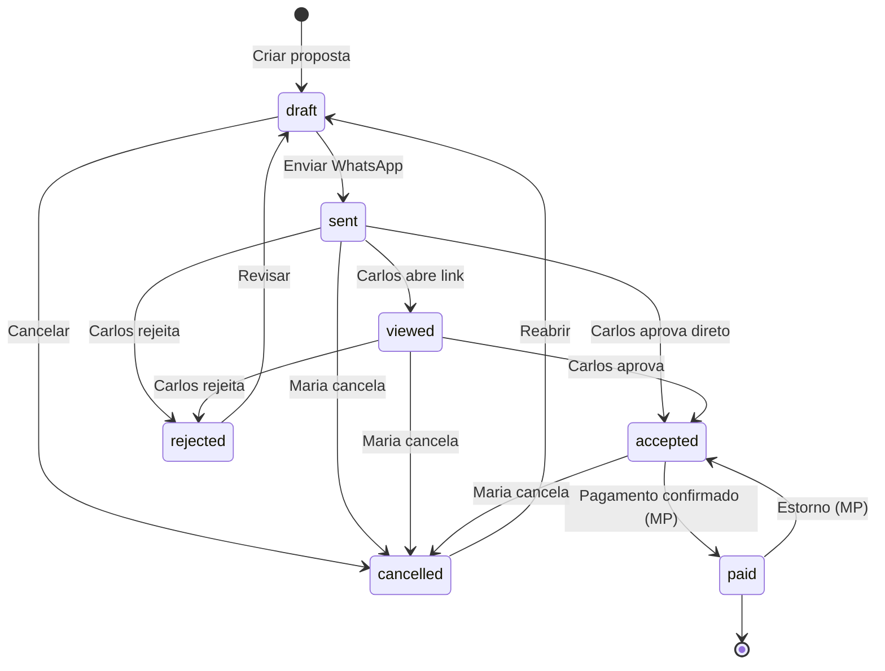
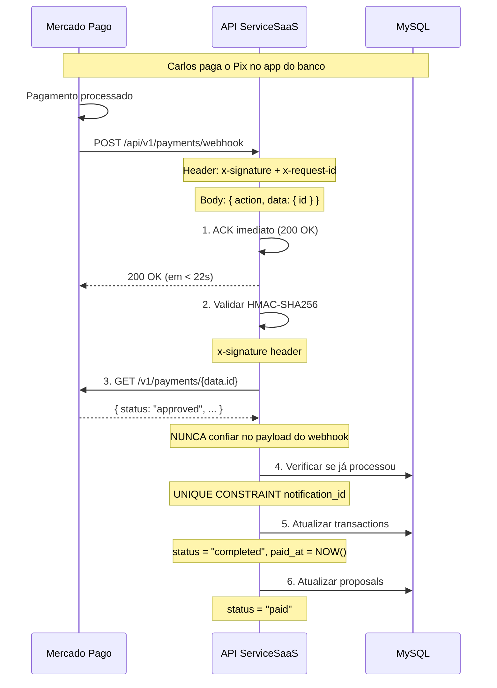

# 🎓 ServiceSaaS — Guia Completo de Conceitos

**Autora:** Paige (Technical Writer)
**Data:** 28 de Julho de 2026
**Público:** Desenvolvedores e stakeholders do projeto
**Conceitos:** Fluxo completo · JWT · Multi-tenancy · State Machine · Docker · Webhook MP

---

## Índice

1. [🌐 Fluxo Completo: Maria → Proposta → Carlos → Aprova → Paga](#1-fluxo-completo)
2. [🔐 Autenticação JWT](#2-autenticacao-jwt)
3. [🏢 Multi-tenancy](#3-multi-tenancy)
4. [📄 State Machine de Propostas](#4-state-machine)
5. [🐳 Arquitetura Docker Compose](#5-docker-compose)
6. [💳 Webhook Mercado Pago](#6-webhook-mercado-pago)

---

<a id="1-fluxo-completo"></a>
## 1. 🌐 Fluxo Completo: Maria → Proposta → Carlos → Aprova → Paga

### 1.1. A Jornada Completa

```
                    ┌──────────────────────────────────────────────────────────────┐
                    │                    SERVICESAAS                               │
                    │                                                              │
  ┌──────┐          │  ┌──────────┐    ┌──────────┐    ┌───────────┐               │
  │Maria │──────────│→ │  Login   │───→│Propostas │───→│  Enviar   │─── WhatsApp ─→│──→ ┌──────┐
  │(Prest)│         │  │  /login  │    │ /criar   │    │WhatsApp   │               │    │Carlos│
  └──────┘          │  └──────────┘    └──────────┘    └───────────┘               │    │(Cli) │
                    │                                      │                       │    └──┬───┘
                    │                                      ▼                       │       │
                    │  ┌──────────┐    ┌──────────┐    ┌───────────┐               │       │
                    │  │   Pago   │←───│  Pagar   │←───│  Aprovar  │←── Link Pub ──│───────┘
                    │  │ (MP Pix) │    │(Checkout)│    │ /p/{token}│               │
                    │  └──────────┘    └──────────┘    └───────────┘               │
                    └──────────────────────────────────────────────────────────────┘
```

### 1.2. Passo a Passo (12 Etapas)

```
ETAPA 1: Maria faz login
─────────────────────────────────────────────────────────────
  Maria → /login.php → POST /api/v1/auth/login → JWT ✅
  Frontend salva token em sessionStorage

ETAPA 2: Maria cria proposta para Carlos
─────────────────────────────────────────────────────────────
  Maria → Nova Proposta
  ├── Seleciona cliente: "Carlos Silva"
  ├── Adiciona itens:
  │   ├── Corte Feminino ........... 1x R$ 65,00
  │   └── Escova ............. 1x R$ 35,00
  ├── Total: R$ 100,00
  └── Salva como rascunho (status: draft)

ETAPA 3: Maria envia via WhatsApp
─────────────────────────────────────────────────────────────
  Maria clica "Enviar WhatsApp"
  Sistema gera link:
  wa.me/5511988880001?text=Ol%C3%A1%20Carlos!...
  Link contém token público: /p/abc123-def456

ETAPA 4: Carlos recebe e clica no link
─────────────────────────────────────────────────────────────
  Carlos → link → GET /api/v1/public/proposals/abc123-def456
  Página pública exibe:
  ├── "Salão da Maria - Proposta #PROP-2026-0001"
  ├── Itens + valores
  ├── Total: R$ 100,00
  └── Botões: [✅ Aprovar] [❌ Rejeitar]

ETAPA 5: Carlos aprova
─────────────────────────────────────────────────────────────
  Carlos clica [✅ Aprovar]
  → PATCH /api/v1/public/proposals/abc123-def456/status
  → Proposta muda de "sent" para "viewed" → "accepted"
  → accepted_at = NOW()

ETAPA 6: Maria vê a aprovação
─────────────────────────────────────────────────────────────
  Maria → Dashboard → Proposta aparece como "Aceita"
  Maria clica [💳 Cobrar]
  → POST /api/v1/payments/create-preference
  → MP retorna link de pagamento

ETAPA 7: Carlos paga via Pix
─────────────────────────────────────────────────────────────
  Carlos acessa link → vê QR Code
  Escaneia com app do banco → paga R$ 100,00
  MP envia webhook → POST /api/v1/payments/webhook

ETAPA 8: Sistema processa pagamento
─────────────────────────────────────────────────────────────
  Webhook validado (HMAC) → GET /v1/payments/:id
  Status: approved
  → transactions.status = 'completed'
  → proposals.status = 'paid'
  → paid_at = NOW()

ETAPA 9: Maria recebe confirmação
─────────────────────────────────────────────────────────────
  Dashboard mostra:
  ┌─────────────────────────────────────────┐
  │ 💰 R$ 100,00  │  💳 Pago via Pix       │
  │ Proposta #1   │  Cliente: Carlos Silva  │
  └─────────────────────────────────────────┘
```

### 1.3. Dados Trafegados

| Etapa | Onde | Origem | Destino | Dados |
|:---:|:---|---|:---|:---|
| 1 | Login | Maria | API | email + password |
| 2 | Criar | Maria | API | cliente + itens + valores |
| 3 | Enviar | API | WhatsApp | link público |
| 4 | Ver | Link | API | token público |
| 5 | Aprovar | Carlos | API | action: approve |
| 6 | Cobrar | Maria | API + MP | proposal_id |
| 7 | Pagar | Carlos | MP | Pix |
| 8 | Webhook | MP | API | payment_id + status |

---

<a id="2-autenticacao-jwt"></a>
## 2. 🔐 Autenticação JWT

### 2.1. O Que é JWT?

JWT (JSON Web Token) é um **token digital** que prova quem você é. Pense como um **crachá de acesso**:

```
┌────────────────────────────────────────────────────┐
│  CRACHÁ DE ACESSO                                  │
├────────────────────────────────────────────────────┤
│  Visitante: Maria (user_id: 42)                   │
│  Empresa: Salão da Maria (tenant_id: 2)            │
│  Cargo: prestador (role: user)                     │
│  Validade: 24 horas                                │
│  ──────────────────────────────────────────────     │
│  Assinado digitalmente (ninguém pode falsificar)   │
└────────────────────────────────────────────────────┘
```

### 2.2. O Fluxo Completo



### 2.3. Código: Como o Middleware Valida

```javascript
// api-backend/middlewares/auth.middleware.js
async function authenticate(req, res, next) {
  const authHeader = req.headers.authorization;
  
  if (!authHeader) {
    return res.status(401).json({
      error: 'ERR_NO_TOKEN',
      message: 'Token de autenticação não fornecido',
    });
  }

  const parts = authHeader.split(' ');
  if (parts.length !== 2 || parts[0] !== 'Bearer') {
    return res.status(401).json({
      error: 'ERR_INVALID_FORMAT',
      message: 'Formato inválido. Use: Authorization: Bearer <token>',
    });
  }

  try {
    const decoded = jwt.verify(parts[1], process.env.JWT_SECRET);
    req.user = {
      userId: decoded.user_id,
      tenantId: decoded.tenant_id,
      role: decoded.role,
    };
    return next(); // ✅ Tudo ok, segue para o controller
  } catch (err) {
    return res.status(401).json({
      error: 'ERR_INVALID_TOKEN',
      message: 'Token inválido ou expirado',
    });
  }
}
```

### 2.4. Anatomia do Token

```javascript
// Gerado em auth.controller.js
const token = jwt.sign(
  {
    user_id: 42,
    tenant_id: 2,
    role: 'user',
  },
  process.env.JWT_SECRET,
  { expiresIn: '24h' }
);

// Resultado (decodificado):
// HEADER:  { "alg": "HS256", "typ": "JWT" }
// PAYLOAD: { "user_id": 42, "tenant_id": 2, "role": "user", "iat": 1722123456, "exp": 1722209856 }
// SIGNATURE: [assinada com JWT_SECRET]
```

### 2.5. Como o PHP Usa o Token

```php
// web-frontend/public/index.php (simplificado)
session_start();

// Login bem-sucedido → guarda token
$_SESSION['jwt'] = $response['token'];

// Requisição à API → envia token
$ch = curl_init('http://api:3000/api/v1/clients');
curl_setopt($ch, CURLOPT_HTTPHEADER, [
  'Authorization: Bearer ' . $_SESSION['jwt'],
]);

// Token expirou? → redireciona ao login
if ($httpCode === 401) {
  session_destroy();
  header('Location: /login.php?sessao_expirada=1');
}
```

---

<a id="3-multi-tenancy"></a>
## 3. 🏢 Multi-tenancy: Como Cada Prestador Só Vê Seus Dados

### 3.1. O Problema

Se Maria e João usam a mesma plataforma, como garantir que Maria **nunca** veja os dados de João?

```
❌ SEM ISOLAMENTO:
  SELECT * FROM clients → Maria vê os 5 clientes dela + os 3 do João

✅ COM ISOLAMENTO (tenant_id):
  SELECT * FROM clients WHERE tenant_id = 2 → Maria vê SÓ os 5 dela
```

### 3.2. A Solução: Middleware de Tenant

```javascript
// api-backend/middlewares/tenant.middleware.js
function tenantMiddleware(req, res, next) {
  // Se é admin (super_admin), NÃO aplica filtro
  if (req.user?.role === 'super_admin') {
    req.tenantFilter = '1=1'; // Vê TUDO
    return next();
  }

  // Para prestadores comuns, injeta tenant_id
  const tenantId = req.user?.tenantId;
  if (!tenantId) {
    return res.status(403).json({ error: 'ERR_NO_TENANT' });
  }

  req.tenantId = tenantId;
  req.tenantFilter = `tenant_id = ${mysqlEscape(tenantId)}`;
  next();
}
```

### 3.3. Como Cada Controller Usa o Filtro

```javascript
// clients.controller.js
async function list(req, res, next) {
  const result = await query(
    `SELECT * FROM clients 
     WHERE ${req.tenantFilter}    ← Filtro automático!
     AND active = TRUE
     ORDER BY name ASC`
  );
  res.json({ clients: result });
}
```

### 3.4. Visualização

```
┌─────────────────────────────────────────────────────────┐
│                    BANCO MYSQL                          │
│                                                         │
│  clients                                                │
│  ┌──────┬───────────┬───────────┬──────────────────┐    │
│  │  id  │   name    │ tenant_id │    outros dados   │    │
│  ├──────┼───────────┼───────────┼──────────────────┤    │
│  │  1   │ Ana       │    2      │ Salão da Maria   │    │
│  │  2   │ Beatriz   │    2      │ Salão da Maria   │    │
│  │  3   │ Carlos    │    2      │ Salão da Maria   │    │
│  │  4   │ Daniel    │    3      │ João Pintor      │    │  ← ISOLADO!
│  │  5   │ Eduardo   │    3      │ João Pintor      │    │  ← ISOLADO!
│  └──────┴───────────┴───────────┴──────────────────┘    │
│                                                         │
│  Maria (tenant_id=2) → vê linhas 1,2,3                  │
│  João (tenant_id=3) → vê linhas 4,5                     │
└─────────────────────────────────────────────────────────┘
```

### 3.5. E a Tabela `transactions`?

O mesmo padrão se aplica. O `tenant.middleware.js` já inclui a tabela `transactions` na lista de tabelas que precisam de filtro:

```javascript
// tenant.middleware.js — tabelas com tenant_id
const tenantTables = [
  'clients', 'categories', 'products_services',
  'proposals', 'proposal_items', 'transactions'  // ← JÁ INCLUÍDA
];
```

**⚠️ Atenção:** Mesmo com o middleware pronto, a tabela `transactions` **precisa ser criada** no banco!

---

<a id="4-state-machine"></a>
## 4. 📄 State Machine de Propostas

### 4.1. O Ciclo de Vida



### 4.2. Implementação

```javascript
// proposals.controller.js
const VALID_TRANSITIONS = {
  draft:     ['sent', 'cancelled'],
  sent:      ['viewed', 'accepted', 'rejected', 'cancelled'],
  viewed:    ['accepted', 'rejected', 'cancelled'],
  accepted:  ['paid', 'cancelled'],
  paid:      ['accepted'],          // via estorno
  rejected:  ['draft', 'cancelled'],
  cancelled: ['draft'],
};

const TIMESTAMP_FIELDS = {
  sent:     'sent_at',
  accepted: 'accepted_at',
  paid:     'paid_at',
};

async function updateStatus(req, res, next) {
  const { id } = req.params;
  const { status: newStatus } = req.body;

  // 1. Buscar status atual
  const [proposal] = await query(
    `SELECT status FROM proposals WHERE id = ? AND ${req.tenantFilter}`,
    [id]
  );

  if (!proposal) {
    return res.status(404).json({ error: 'ERR_NOT_FOUND' });
  }

  const currentStatus = proposal.status;

  // 2. Validar transição
  const allowed = VALID_TRANSITIONS[currentStatus];
  if (!allowed || !allowed.includes(newStatus)) {
    return res.status(400).json({
      error: 'ERR_INVALID_TRANSITION',
      message: `Não é possível transicionar de "${currentStatus}" para "${newStatus}"`,
      allowedTransitions: allowed || [],
    });
  }

  // 3. Montar update
  const updates = { status: newStatus };
  const timestampField = TIMESTAMP_FIELDS[newStatus];
  if (timestampField) {
    updates[timestampField] = new Date();
  }

  await query(`UPDATE proposals SET ? WHERE id = ?`, [updates, id]);

  res.json({ message: 'Status atualizado', status: newStatus });
}
```

### 4.3. Timestamps Automáticos

| Transição | Campo | Exemplo |
|:---|---|:---|
| `draft → sent` | `sent_at` | 2026-07-28 10:30:00 |
| `sent → accepted` | `accepted_at` | 2026-07-28 14:15:00 |
| `accepted → paid` | `paid_at` | 2026-07-28 14:20:00 |

---

<a id="5-docker-compose"></a>
## 5. 🐳 Arquitetura Docker Compose

### 5.1. Os 5 Containers

```
┌──────────────────────────────────────────────────────────────────┐
│                      DOCKER NETWORK                              │
│                                                                  │
│  ┌──────────┐    ┌──────────┐    ┌──────────┐    ┌──────────┐   │
│  │  NGINX   │───→│   PHP    │    │   API    │    │  MYSQL   │   │
│  │ :80 (ext)│    │ :9000    │    │ :3000    │    │ :3306    │   │
│  │ 1.25-alp │    │ 8.2-fpm  │    │ 20-alpine│    │ 8.0      │   │
│  └────┬─────┘    └──────────┘    └────┬─────┘    └──────────┘   │
│       │                               │                          │
│       └──────────→ /api/v1/* ─────────┘                          │
│                                                                  │
│  ┌──────────────────────────────────────────────┐                │
│  │  phpMyAdmin :8081 (dev only)                 │                │
│  └──────────────────────────────────────────────┘                │
└──────────────────────────────────────────────────────────────────┘
         │
         ▼
  SUA MÁQUINA: http://localhost:8080
```

### 5.2. docker-compose.yml (Simplificado)

```yaml
services:
  nginx:
    image: nginx:1.25-alpine
    ports: ["8080:80"]
    volumes:
      - ./nginx/default.conf:/etc/nginx/conf.d/default.conf
      - ./web-frontend:/var/www/html
    depends_on: [php, api]

  php:
    build: ./web-frontend
    expose: ["9000"]
    volumes:
      - ./web-frontend:/var/www/html
    depends_on: [mysql]

  api:
    build: ./api-backend
    ports: ["3000:3000"]
    depends_on: [mysql]

  mysql:
    image: mysql:8.0
    environment:
      MYSQL_DATABASE: servicos_flex
      MYSQL_USER: servicos
      MYSQL_PASSWORD: servicos_pass

  pma:
    image: phpmyadmin:latest
    ports: ["8081:80"]
    depends_on: [mysql]
```

### 5.3. Fluxo de uma Requisição

```
Você abre http://localhost:8080/dashboard.php
1. Navegador → Nginx (porta 8080)
2. Nginx vê que é .php → encaminha para PHP (fastcgi :9000)
3. PHP executa dashboard.php → precisa de dados da API
4. PHP faz fetch para http://api:3000/api/v1/dashboard
5. Docker DNS resolve "api" para o container correto
6. API Node.js processa → query MySQL
7. MySQL retorna dados
8. API → PHP → Nginx → Navegador
```

### 5.4. Health Check

```yaml
# docker-compose.yml
healthcheck:
  test: ["CMD", "node", "-e", "require('http').get('http://127.0.0.1:3000/health',r=>process.exit(r.statusCode===200?0:1)).on('error',()=>process.exit(1))"]
  interval: 30s
  timeout: 5s
  retries: 3
```

---

<a id="6-webhook-mercado-pago"></a>
## 6. 💳 Webhook Mercado Pago

### 6.1. O Que é um Webhook?

```
Imagine que você pediu uma pizza:
                                                    
  Você liga   → "A pizza está pronta?"  ── polling ──❌
               → "E agora?" 
               → "E agora?"
                                                    
  Com webhook: a pizzaria te liga quando fica pronta ✅
```

No ServiceSaaS, quando Carlos paga a proposta no Mercado Pago, o MP **avisa** nossa API automaticamente. Não precisamos ficar perguntando.

### 6.2. Fluxo Completo do Webhook



### 6.3. Validação HMAC (Segurança)

```javascript
// Validação obrigatória - sem ela, QUALQUER um pode "fingir" ser MP
const crypto = require('crypto');

function validateWebhookSignature(req) {
  const signature = req.headers['x-signature'];
  const requestId = req.headers['x-request-id'];
  const dataId = req.query['data.id'];
  
  if (!signature || !requestId || !dataId) return false;

  // Parse: "ts=1234567890,v1=abcdef..."
  const parts = {};
  signature.split(',').forEach(pair => {
    const [k, v] = pair.split('=');
    parts[k.trim()] = v.trim();
  });

  // String a ser verificada
  const manifest = `id:${dataId};request-id:${requestId};ts:${parts.ts};`;
  
  const hash = crypto
    .createHmac('sha256', process.env.MP_WEBHOOK_SECRET)
    .update(manifest)
    .digest('hex');

  // Comparação em TEMPO CONSTANTE (previne timing attack)
  return crypto.timingSafeEqual(
    Buffer.from(hash),
    Buffer.from(parts.v1)
  );
}
```

### 6.4. Handler de Webhook (Estrutura)

```javascript
async function handleWebhook(req, res) {
  // 1. ACK IMEDIATO — MP espera resposta em < 22 segundos
  res.status(200).json({ received: true });

  // 2. Validar assinatura
  if (!validateWebhookSignature(req)) {
    console.warn('⚠️ Webhook rejeitado: assinatura inválida');
    return;
  }

  // 3. Verificar se já processamos este evento (idempotência)
  const notificationId = req.body.id;
  const existing = await query(
    'SELECT id FROM transactions WHERE mp_notification_id = ?',
    [notificationId]
  );
  if (existing.length > 0) return; // Já processado!

  // 4. Buscar status REAL do pagamento na API do MP
  const paymentId = req.body.data?.id;
  const payment = await mercadopagoService.getPayment(paymentId);

  // 5. Mapear status MP → status ServiceSaaS
  const STATUS_MAP = {
    approved:  'completed',
    rejected:  'cancelled',
    refunded:  'refunded',
    chargeback:'chargeback',
    in_process:'pending',
    pending:   'pending',
  };

  // 6. Atualizar banco
  await query('UPDATE transactions SET ... WHERE mp_payment_id = ?', [paymentId]);
  
  if (payment.status === 'approved') {
    await query('UPDATE proposals SET status = "paid" WHERE id = ?', [proposalId]);
  }
}
```

### 6.5. Estados do Pagamento

```
┌──────────┐     ┌──────────┐     ┌──────────┐
│ PENDING  │────→│APPROVED  │────→│ REFUNDED │
│ (pendente)│    │(aprovado) │     │(estornado)│
└──────────┘     └──────────┘     └──────────┘
       │               │
       ▼               ▼
┌──────────┐     ┌──────────┐
│REJECTED  │     │CHARGEBACK│
│(recusado)│     │(contest.)│
└──────────┘     └──────────┘
```

---

## Resumo dos 6 Conceitos

| # | Conceito | Essência | Uma Frase |
|:---:|---|---|:---|
| 1 | 🌐 Fluxo Completo | Maria cria → Carlos aprova → Paga | "O caminho que os dados percorrem do cadastro ao pagamento" |
| 2 | 🔐 JWT | Token de acesso digital | "Um crachá que prova quem você é por 24h" |
| 3 | 🏢 Multi-tenancy | Isolamento de dados | "Cada prestador só vê os próprios dados" |
| 4 | 📄 State Machine | Ciclo de vida da proposta | "Rascunho → Enviado → Visto → Aceito → Pago" |
| 5 | 🐳 Docker | 5 containers isolados | "Cada serviço em seu container, tudo orquestrado" |
| 6 | 💳 Webhook MP | Notificação automática | "MP avisa a API quando o pagamento é confirmado" |

---

*Guia explicativo gerado por Paige (Technical Writer) em 28 de Julho de 2026*
