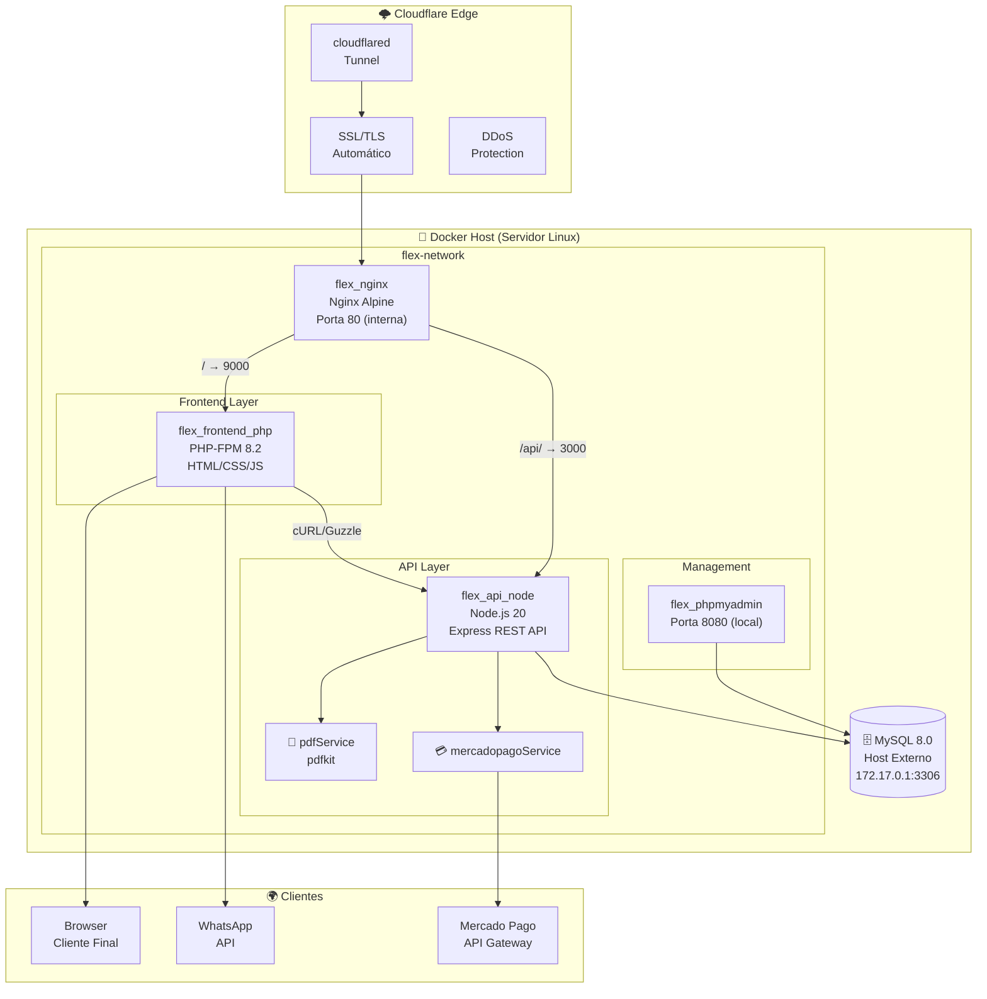
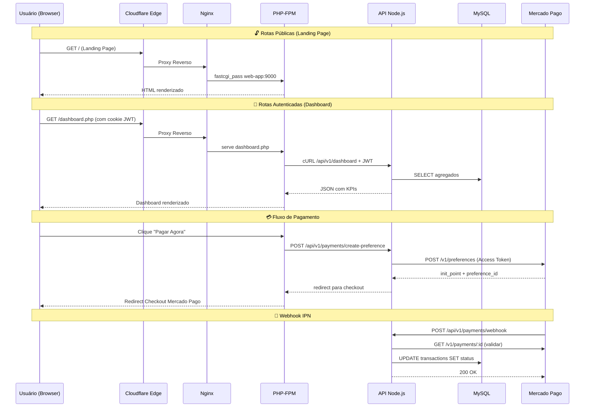
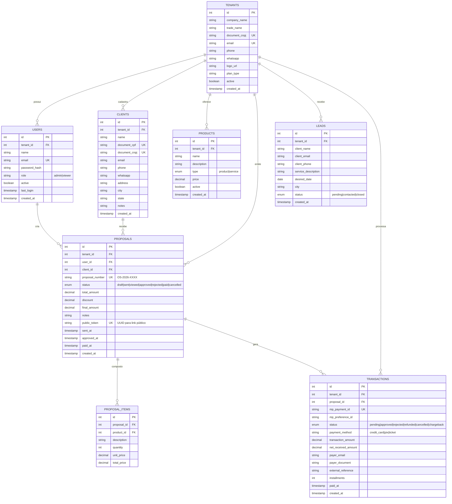
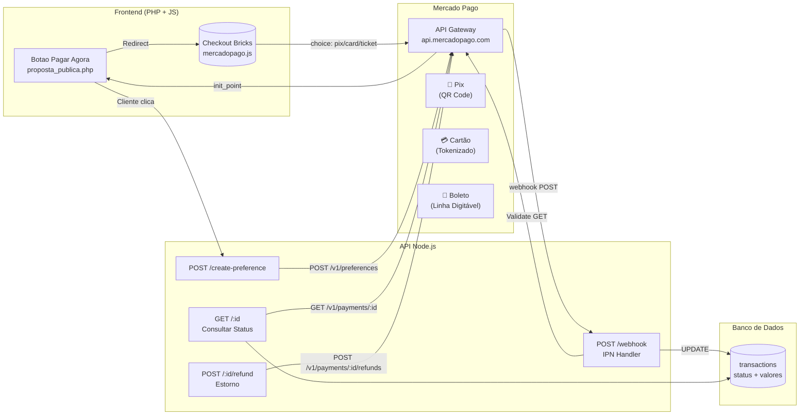
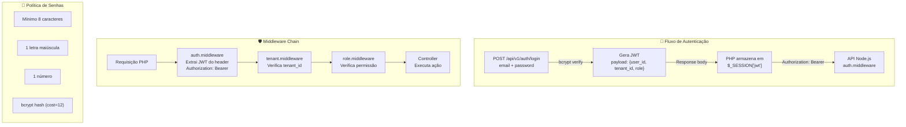
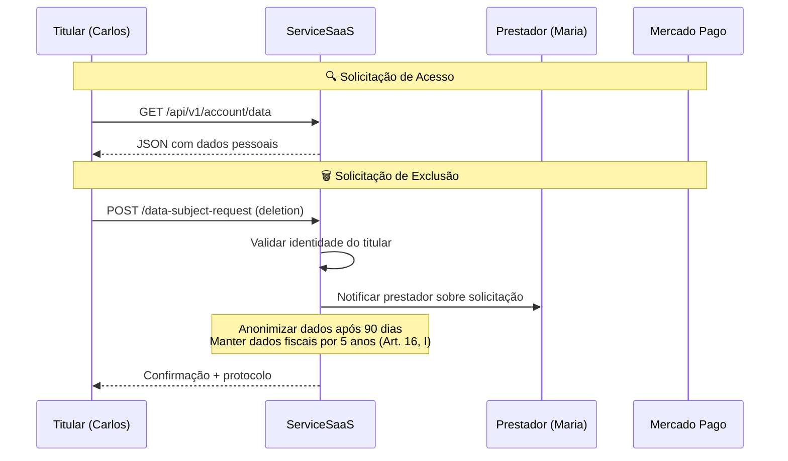
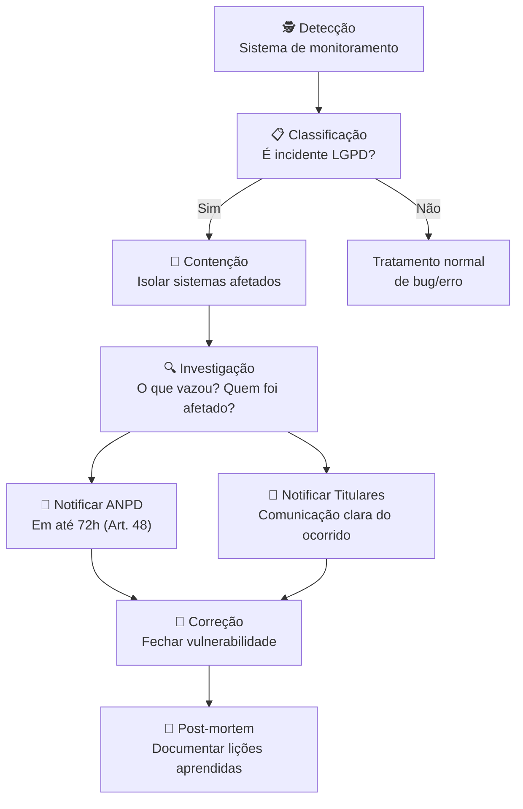

# 🚀 ServiceSaaS — Plano Estratégico de Execução

**Plataforma de Gestão Inteligente para Prestadores de Serviços**

---

| Metadado | Valor |
|:---|---:|
| **Versão** | `2.0` |
| **Data** | `2026-07-27` |
| **Classificação** | Público Interno |
| **Autor** | Auditoria & Planejamento Estratégico |
| **Status** | ✅ Aprovado / Pronto para Desenvolvimento |
| **Stack** | PHP 8.2 · Node.js 20 · MySQL 8 · Docker · Cloudflare |
| **Repositório** | `servicos-flex/` |

---

## 📑 Índice

1. [Visão Executiva](#1-visão-executiva)
2. [Auditoria de Artefatos](#2-auditoria-de-artefatos)
3. [Decisões Arquiteturais (ADRs)](#3-decisões-arquiteturais-adrs)
4. [Stack Tecnológica Definitiva](#4-stack-tecnológica-definitiva)
5. [Arquitetura do Sistema](#5-arquitetura-do-sistema)
6. [Modelo de Dados](#6-modelo-de-dados)
7. [Roadmap de Implementação](#7-roadmap-de-implementação)
8. [Pipeline CI/CD e QA](#8-pipeline-cicd-e-qa)
9. [Integração Mercado Pago](#9-integração-mercado-pago)
10. [Segurança e LGPD](#10-segurança-e-lgpd)
11. [Observabilidade e Monitoramento](#11-observabilidade-e-monitoramento)
12. [Estimativa de Custos (FinOps)](#12-estimativa-de-custos-finops)
13. [Matriz de Riscos e Contingência](#13-matriz-de-riscos-e-contingência)
14. [Estrutura de Equipe e Governança](#14-estrutura-de-equipe-e-governança)
15. [Próximos Passos](#15-próximos-passos)

---

## 1. Visão Executiva

### 1.1 O Produto

O **ServiceSaaS** é uma plataforma SaaS web responsiva que simplifica a criação, gestão, envio e aprovação de orçamentos e propostas comerciais para **profissionais autônomos, liberais e pequenas empresas**.

### 1.2 Problema que Resolve

Prestadores de serviço no Brasil gastam em média **4-6 horas por semana** criando propostas manuais, controlando aprovações e gerenciando cobranças. O ServiceSaaS reduz isso para **minutos**, integrando:
- 📝 Criação inteligente de propostas (mestre-detalhe)
- 💬 Envio via WhatsApp com template customizável
- ✅ Aprovação digital com 1 clique
- 💳 Cobrança integrada (Mercado Pago — Pix, Cartão, Boleto)
- 📊 Dashboard gerencial com KPIs em tempo real

### 1.3 Métricas de Sucesso (OKRs)

| Objetivo | Key Result | Meta (3 meses) |
|:---|---:|---:|
| Adoção | Propostas criadas por tenant/mês | ≥ 20 |
| Conversão | Taxa de aprovação de propostas | ≥ 65% |
| Recebimento | Propostas pagas via Mercado Pago | ≥ 40% |
| Performance | Tempo de carregamento (LCP) | ≤ 2.5s |
| Retenção | Usuários ativos (semanais) | ≥ 70% |

---

## 2. Auditoria de Artefatos

### 2.1 Inventário Completo

| # | Artefato | Tipo | Escopo | Maturidade | Ação |
|:---:|:---|---|:---:|:---:|:---:|
| 1 | `docs/prd/service.md` | PRD Original | Produto completo | ✅ Completo | 📦 Arquivado — substituído pelo Moderno |
| 2 | `docs/prd/prd_servicos_flex_php_nodejs.md` | PRD v2.0 | Stack PHP + Node.js | ✅ Completo | 📦 Arquivado — substituído pelo Moderno |
| 3 | `docs/prd/prd_servicos_flex_cloudflare_docker.md` | PRD v3.0 | Arquitetura Docker + Cloudflare | ✅ Completo | 📦 Arquivado — incorporado ao Moderno |
| 4 | `layout/clienets_especificacao_landing_page_servicos_flex.md` | Landing Page Spec | Vitrine + Wizard | ✅ Completo | Implementar |
| 5 | `scripts/preparar-server-code.sh` | Script Shell | Setup servidor | ✅ Completo | Usar |
| 6 | `scripts/gemini-code-1785185628224.yaml` | Docker Compose | Docker com Tunnel | ✅ Completo | Adotar |
| 12 | `scripts/nginx-1785185642421.txt` | Nginx Config | Proxy reverso | ✅ Completo | Adaptar |
| 13 | `scripts/variaveis-cloudeflare.txt` | Env Template | Variáveis de ambiente | ✅ Completo | Usar |

### 2.2 Inconsistências Resolvidas

| Inconsistência | Resolução |
|:---|---|
| 🔴 Stack dupla (PHP vs Node.js puro) | ✅ **PHP 8.2** (Frontend) + **Node.js/Express** (API) |
| 🔴 Tipografia (Lato vs Poppins) | ✅ **Poppins** — fonte moderna e arredondada |
| 🔴 Cor primária (Azul `#2563EB` vs Verde `#10B981`) | ✅ **Verde Esmeralda `#10B981`** — transmite crescimento |
| 🟡 Estrutura de código (Monolítica vs MVC vs Modular) | ✅ **Modular por Domínio** — escalabilidade |

### 2.3 Lacunas Identificadas

| Lacuna | Status | Impacto |
|:---|---|:---:|
| Código-fonte zero | ⬜️ Pendente | Crítico |
| Modelo de dados incompleto | ⬜️ Pendente | Crítico |
| Integração Mercado Pago sem especificação | ✅ Resolvido (Seção 9) | Alto |
| Autenticação/Autorização sem detalhes | ✅ Resolvido (Seção 10) | Alto |
| CI/CD e QA não definidos | ✅ Resolvido (Seção 8) | Médio |
| Custos de infraestrutura não estimados | ✅ Resolvido (Seção 12) | Médio |

---

## 3. Decisões Arquiteturais (ADRs)

### ADR-001: Stack de Frontend

| Campo | Valor |
|:---|---|
| **Contexto** | Os PRDs v2.0 e v3.0 divergem entre PHP puro e Node.js para o frontend |
| **Decisão** | **PHP 8.2 + HTML5/CSS3/JavaScript ES6+** para a camada de apresentação |
| **Consequências** | + Simplicidade de deploy, + Facilidade de manutenção, - Menos interatividade que SPA |
| **Status** | ✅ Aceita |

### ADR-002: Arquitetura de Containers

| Campo | Valor |
|:---|---|
| **Contexto** | Necessidade de isolamento entre frontend, API e banco de dados |
| **Decisão** | **Docker Compose multi-container** com serviços independentes (Nginx, PHP-FPM, Node.js, phpMyAdmin) + Cloudflare Tunnel |
| **Consequências** | + Isolamento total, + Atualizações zero-downtime, - Overhead de gerenciamento |
| **Status** | ✅ Aceita |

### ADR-003: Exposição Web Segura

| Campo | Valor |
|:---|---|
| **Contexto** | Necessidade de HTTPS sem expor portas no firewall |
| **Decisão** | **Cloudflare Tunnel (cloudflared)** — conexão criptografada de saída |
| **Consequências** | + DDoS protection, + SSL automático, + Oculta IP real |
| **Status** | ✅ Aceita |

### ADR-004: Gateway de Pagamento

| Campo | Valor |
|:---|---|
| **Contexto** | Necessidade de aceitar Pix, Cartão e Boleto no Brasil |
| **Decisão** | **Mercado Pago** com Checkout Bricks (frontend) + Webhooks IPN (backend) |
| **Consequências** | + Checkout regulatório brasileiro, + Split de pagamentos, - Taxas por transação |
| **Status** | ✅ Aceita |

### ADR-005: Estrutura de Código

| Campo | Valor |
|:---|---|
| **Contexto** | Necessidade de organização que escale com o produto |
| **Decisão** | **Modular por Domínio** — pastas isoladas para auth, clients, proposals, payments |
| **Consequências** | + Coesão alta, + Acoplamento baixo, + Facilita testes unitários |
| **Status** | ✅ Aceita |

> 📂 ADRs armazenados em `docs/adr/` conforme o repositório crescer.

### ADR-006: Identidade Visual (Cor Primária)

| Campo | Valor |
|:---|---|
| **Contexto** | PRDs originais usavam Azul `#2563EB` enquanto o design system ServiceSaaS especificava Verde Esmeralda `#10B981`. Inconsistência identificada na auditoria. |
| **Decisão** | **Verde Esmeralda `#10B981`** como cor primária — transmite crescimento, confiança e está alinhado com o mercado financeiro/serviços brasileiro |
| **Consequências** | + Identidade única no mercado de SaaS, + Contraste WCAG AAA com fundos escuros, - Requer atualização de todos os assets visuais dos PRDs anteriores |
| **Status** | ✅ Aceita |

### ADR-007: Banco de Dados Relacional

| Campo | Valor |
|:---|---|
| **Contexto** | Dados estruturados com relacionamentos complexos (tenants → clientes → propostas → itens → transações). Necessidade de integridade referencial, transações ACID e índices de performance. |
| **Decisão** | **MySQL 8.0** — maturidade, ecossistema consolidado, performance comprovada para cargas OLTP, suporte nativo a JSON para dados semiestruturados (fee_details do MP) |
| **Consequências** | + Integridade referencial via FK, + JSON column para flexibilidade, - Limitações em sharding horizontal nativo comparado ao PostgreSQL |
| **Alternativas Rejeitadas** | PostgreSQL (curva de aprendizado maior para a equipe), MongoDB (sem junções nativas, inadequado para o modelo mestre-detalhe), SQLite (sem concorrência para produção) |
| **Status** | ✅ Aceita |

### ADR-008: Geração de PDF

| Campo | Valor |
|:---|---|
| **Contexto** | Necessidade de gerar documentos profissionais (propostas, faturas, relatórios) em PDF com layout customizável e logo do tenant. |
| **Decisão** | **pdfkit** (Node.js) — biblioteca nativa JS, sem dependências de navegador (diferente do Puppeteer), menor consumo de memória em container Docker |
| **Consequências** | + Leve (~5MB vs ~300MB do Puppeteer), + Rápido em containers, - Layout CSS limitado comparado a HTML→PDF |
| **Alternativas Rejeitadas** | Puppeteer (overhead de memória, mais lento em containers), PHP TCPDF/Dompdf (ecossistema menos maduro que Node.js) |
| **Status** | ✅ Aceita |

### ADR-009: Cache e Performance

| Campo | Valor |
|:---|---|
| **Contexto** | O frontend PHP consome a API Node.js via cURL/Guzzle, adicionando latência de rede entre containers. Páginas de dashboard com múltiplos KPIs podem fazer N requisições sequenciais. |
| **Decisão** | **Cache Nginx (micro-cache)** para assets estáticos + **Endpoint agregado** `/api/v1/dashboard/summary` para reduzir chamadas. Redis adiado para v1.1 se necessário. |
| **Consequências** | + Zero dependência adicional no MVP, + Simplicidade operacional, - Sem cache de dados dinâmicos entre requisições de diferentes usuários |
| **Status** | ✅ Aceita (MVP) |

---

## 4. Stack Tecnológica Definitiva

| Camada | Tecnologia | Versão | Função |
|:---|---|:---:|:---|
| **🌐 Frontend** | PHP + HTML5 + CSS3 + JS ES6+ | 8.2 | Apresentação e formulários |
| **⚙️ API REST** | Node.js + Express.js | 20 LTS | Regras de negócio e dados |
| **🗄️ Banco de Dados** | MySQL | 8.0 | Persistência relacional |
| **🔁 Proxy Reverso** | Nginx | Alpine | Roteamento e cache |
| **🐳 Containerização** | Docker Compose | 3.8+ | Isolamento de serviços |
| **🔒 Túnel Seguro** | Cloudflare Tunnel (cloudflared) | latest | Exposição web sem portas |
| **📄 Geração de PDF** | pdfkit | latest | Documentos profissionais |
| **📊 Dashboard** | Chart.js | 4.x | Gráficos financeiros |
| **💳 Pagamentos** | Mercado Pago SDK JS + Node | v4 | Pix, Cartão, Boleto |
| **🛠️ Gerenciamento BD** | phpMyAdmin | latest | Administração visual |

---

## 5. Arquitetura do Sistema

### 5.1 Diagrama de Containers



### 5.2 Fluxo de Requisições



### 5.3 Estrutura de Diretórios (Modular por Domínio)

```
servicos-flex/
│
├── .env                         # Variáveis de ambiente (NUNCA versionar)
├── .env.example                 # Template para novos devs
├── .gitignore
├── docker-compose.yml           # Orquestração multi-container
├── docker-compose.override.yml  # Override para desenvolvimento local
├── Makefile                     # Comandos comuns (make up, make down, make logs)
├── README.md
│
├── docs/
│   ├── adr/                     # Architecture Decision Records
│   └── api/                     # Documentação da API (OpenAPI 3.0 futuramente)
│
├── nginx/
│   └── default.conf             # Configuração do proxy reverso
│
├── scripts/
│   ├── setup.sh                 # Script de setup inicial
│   ├── seed.sql                 # Dados de seed para desenvolvimento
│   └── migrate.sh               # Script de migração do banco
│
├── web-frontend/                # 🐳 Container PHP-FPM
│   ├── Dockerfile
│   ├── config/
│   │   ├── api_client.php       # HTTP Client para API Node.js
│   │   ├── session.php          # Gerenciamento de sessão PHP
│   │   └── helpers.php          # Funções utilitárias
│   ├── public/
│   │   ├── index.php            # Landing Page
│   │   ├── login.php            # Login
│   │   ├── register.php         # Cadastro (PF/PJ)
│   │   ├── proposta_publica.php # Página pública da proposta
│   │   ├── dashboard.php        # Painel gerencial
│   │   ├── clientes.php         # CRUD Clientes
│   │   ├── produtos_servicos.php# CRUD Produtos/Serviços
│   │   ├── propostas.php        # Listagem de propostas
│   │   ├── proposta_form.php    # Formulário mestre-detalhe
│   │   ├── configuracoes.php    # Configurações do tenant
│   │   ├── financeiro.php       # 💳 Painel financeiro (Mercado Pago)
│   │   ├── css/
│   │   │   ├── app.css          # Estilos globais
│   │   │   └── landing.css      # Estilos da Landing Page
│   │   └── js/
│   │       ├── app.js           # Core JS
│   │       ├── menu.js          # Menu responsivo mobile
│   │       ├── landing.js       # Landing Page (busca + wizard)
│   │       ├── masks.js         # Máscaras (CPF, CNPJ, telefone, moeda)
│   │       ├── proposals.js     # Lógica mestre-detalhe
│   │       └── mercadopago.js   # 💳 SDK Mercado Pago Checkout Bricks
│   └── templates/
│       └── whatsapp.md          # Template de mensagem WhatsApp
│
└── api-backend/                 # 🐳 Container Node.js
    ├── Dockerfile
    ├── package.json
    ├── server.js                # Entry point
    ├── config/
    │   ├── database.js          # Conexão MySQL (mysql2 pool)
    │   ├── auth.js              # Config JWT
    │   └── mercadopago.js       # Config Mercado Pago SDK
    ├── middlewares/
    │   ├── auth.middleware.js   # JWT validation
    │   ├── tenant.middleware.js # Multi-tenancy isolation
    │   ├── validation.middleware.js
    │   └── error.middleware.js  # Global error handler
    ├── modules/
    │   ├── auth/
    │   │   ├── auth.routes.js
    │   │   ├── auth.controller.js
    │   │   └── auth.service.js
    │   ├── clients/
    │   │   ├── clients.routes.js
    │   │   ├── clients.controller.js
    │   │   └── clients.service.js
    │   ├── products/
    │   │   ├── products.routes.js
    │   │   ├── products.controller.js
    │   │   └── products.service.js
    │   ├── proposals/
    │   │   ├── proposals.routes.js
    │   │   ├── proposals.controller.js
    │   │   ├── proposals.service.js
    │   │   └── proposals.validator.js
    │   ├── dashboard/
    │   │   ├── dashboard.routes.js
    │   │   ├── dashboard.controller.js
    │   │   └── dashboard.service.js
    │   ├── payments/
    │   │   ├── payments.routes.js
    │   │   ├── payments.controller.js
    │   │   ├── payments.service.js    # 💳 Lógica Mercado Pago
    │   │   └── payments.webhook.js    # 📩 IPN Handler
    │   └── public/
    │       ├── public.routes.js
    │       ├── public.controller.js
    │       └── public.service.js
    ├── models/
    │   ├── User.js
    │   ├── Tenant.js
    │   ├── Client.js
    │   ├── Product.js
    │   ├── Proposal.js
    │   ├── ProposalItem.js
    │   ├── Lead.js
    │   └── Transaction.js        # 💳 Transações
    └── services/
        ├── pdfService.js         # 📄 Geração de PDF (pdfkit)
        └── whatsappService.js    # 💬 Geração de link WhatsApp
```

---

## 6. Modelo de Dados

### 6.1 Diagrama Entidade-Relacionamento (MER)



### 6.2 Script de Criação (MySQL 8.0)

```sql
-- Database
CREATE DATABASE IF NOT EXISTS servicos_flex
  CHARACTER SET utf8mb4
  COLLATE utf8mb4_unicode_ci;

USE servicos_flex;

-- 1. Tenants (Empresas / Profissionais)
CREATE TABLE tenants (
    id INT AUTO_INCREMENT PRIMARY KEY,
    company_name VARCHAR(150) NOT NULL,
    trade_name VARCHAR(150),
    document_cnpj VARCHAR(18) UNIQUE,
    email VARCHAR(150) UNIQUE NOT NULL,
    phone VARCHAR(20),
    whatsapp VARCHAR(20),
    logo_url VARCHAR(500),
    plan_type ENUM('free', 'basic', 'pro', 'enterprise') DEFAULT 'free',
    active BOOLEAN DEFAULT TRUE,
    created_at TIMESTAMP DEFAULT CURRENT_TIMESTAMP,
    updated_at TIMESTAMP DEFAULT CURRENT_TIMESTAMP ON UPDATE CURRENT_TIMESTAMP
) ENGINE=InnoDB;

-- 2. Users (Usuários do sistema)
CREATE TABLE users (
    id INT AUTO_INCREMENT PRIMARY KEY,
    tenant_id INT NOT NULL,
    name VARCHAR(150) NOT NULL,
    email VARCHAR(150) NOT NULL,
    password_hash VARCHAR(255) NOT NULL,
    role ENUM('admin', 'viewer') DEFAULT 'admin',
    active BOOLEAN DEFAULT TRUE,
    last_login TIMESTAMP NULL,
    created_at TIMESTAMP DEFAULT CURRENT_TIMESTAMP,
    updated_at TIMESTAMP DEFAULT CURRENT_TIMESTAMP ON UPDATE CURRENT_TIMESTAMP,
    UNIQUE KEY uk_email_tenant (email, tenant_id),
    FOREIGN KEY (tenant_id) REFERENCES tenants(id) ON DELETE CASCADE
) ENGINE=InnoDB;

-- 3. Clients (Clientes dos prestadores)
CREATE TABLE clients (
    id INT AUTO_INCREMENT PRIMARY KEY,
    tenant_id INT NOT NULL,
    name VARCHAR(150) NOT NULL,
    document_cpf VARCHAR(14),
    document_cnpj VARCHAR(18),
    email VARCHAR(150),
    phone VARCHAR(20),
    whatsapp VARCHAR(20),
    address VARCHAR(255),
    city VARCHAR(100),
    state CHAR(2),
    notes TEXT,
    created_at TIMESTAMP DEFAULT CURRENT_TIMESTAMP,
    updated_at TIMESTAMP DEFAULT CURRENT_TIMESTAMP ON UPDATE CURRENT_TIMESTAMP,
    FOREIGN KEY (tenant_id) REFERENCES tenants(id) ON DELETE CASCADE
) ENGINE=InnoDB;

-- 4. Products_Services (Catálogo)
CREATE TABLE products_services (
    id INT AUTO_INCREMENT PRIMARY KEY,
    tenant_id INT NOT NULL,
    name VARCHAR(200) NOT NULL,
    description TEXT,
    type ENUM('product', 'service') NOT NULL DEFAULT 'service',
    price DECIMAL(10,2) NOT NULL DEFAULT 0.00,
    active BOOLEAN DEFAULT TRUE,
    created_at TIMESTAMP DEFAULT CURRENT_TIMESTAMP,
    updated_at TIMESTAMP DEFAULT CURRENT_TIMESTAMP ON UPDATE CURRENT_TIMESTAMP,
    FOREIGN KEY (tenant_id) REFERENCES tenants(id) ON DELETE CASCADE
) ENGINE=InnoDB;

-- 5. Proposals (Cabeçalho)
CREATE TABLE proposals (
    id INT AUTO_INCREMENT PRIMARY KEY,
    tenant_id INT NOT NULL,
    user_id INT NOT NULL,
    client_id INT,
    proposal_number VARCHAR(20) NOT NULL,
    status ENUM('draft','sent','viewed','approved','rejected','paid','cancelled') DEFAULT 'draft',
    total_amount DECIMAL(10,2) NOT NULL DEFAULT 0.00,
    discount DECIMAL(10,2) DEFAULT 0.00,
    final_amount DECIMAL(10,2) NOT NULL DEFAULT 0.00,
    notes TEXT,
    public_token VARCHAR(36) UNIQUE,
    sent_at TIMESTAMP NULL,
    approved_at TIMESTAMP NULL,
    paid_at TIMESTAMP NULL,
    created_at TIMESTAMP DEFAULT CURRENT_TIMESTAMP,
    updated_at TIMESTAMP DEFAULT CURRENT_TIMESTAMP ON UPDATE CURRENT_TIMESTAMP,
    FOREIGN KEY (tenant_id) REFERENCES tenants(id) ON DELETE CASCADE,
    FOREIGN KEY (user_id) REFERENCES users(id),
    FOREIGN KEY (client_id) REFERENCES clients(id)
) ENGINE=InnoDB;

-- 6. Proposal_Items (Itens — Mestre-Detalhe)
CREATE TABLE proposal_items (
    id INT AUTO_INCREMENT PRIMARY KEY,
    proposal_id INT NOT NULL,
    product_id INT,
    description VARCHAR(500) NOT NULL,
    quantity DECIMAL(10,3) NOT NULL DEFAULT 1,
    unit_price DECIMAL(10,2) NOT NULL DEFAULT 0.00,
    total_price DECIMAL(10,2) GENERATED ALWAYS AS (quantity * unit_price) STORED,
    FOREIGN KEY (proposal_id) REFERENCES proposals(id) ON DELETE CASCADE,
    FOREIGN KEY (product_id) REFERENCES products_services(id)
) ENGINE=InnoDB;

-- 7. Public_Leads (Landing Page)
CREATE TABLE public_leads (
    id INT AUTO_INCREMENT PRIMARY KEY,
    tenant_id INT,
    client_name VARCHAR(150) NOT NULL,
    client_email VARCHAR(150) NOT NULL,
    client_phone VARCHAR(20) NOT NULL,
    service_description TEXT NOT NULL,
    desired_date DATE,
    city VARCHAR(100),
    status ENUM('pending','contacted','closed') DEFAULT 'pending',
    created_at TIMESTAMP DEFAULT CURRENT_TIMESTAMP,
    FOREIGN KEY (tenant_id) REFERENCES tenants(id) ON DELETE SET NULL
) ENGINE=InnoDB;

-- 8. Transactions (Mercado Pago)
CREATE TABLE transactions (
    id INT AUTO_INCREMENT PRIMARY KEY,
    tenant_id INT NOT NULL,
    proposal_id INT NOT NULL,
    mp_payment_id VARCHAR(50) UNIQUE,
    mp_preference_id VARCHAR(100),
    status ENUM('pending','approved','rejected','refunded','cancelled','chargeback') DEFAULT 'pending',
    payment_method VARCHAR(50),
    transaction_amount DECIMAL(10,2) NOT NULL,
    net_received_amount DECIMAL(10,2),
    payer_email VARCHAR(150),
    payer_document VARCHAR(20),
    external_reference VARCHAR(100),
    installments INT DEFAULT 1,
    paid_at TIMESTAMP NULL,
    created_at TIMESTAMP DEFAULT CURRENT_TIMESTAMP,
    updated_at TIMESTAMP DEFAULT CURRENT_TIMESTAMP ON UPDATE CURRENT_TIMESTAMP,
    FOREIGN KEY (tenant_id) REFERENCES tenants(id),
    FOREIGN KEY (proposal_id) REFERENCES proposals(id)
) ENGINE=InnoDB;

-- Indexes
CREATE INDEX idx_proposals_tenant_status ON proposals(tenant_id, status);
CREATE INDEX idx_proposals_public_token ON proposals(public_token);
CREATE INDEX idx_transactions_proposal ON transactions(proposal_id);
CREATE INDEX idx_transactions_mp ON transactions(mp_payment_id);
CREATE INDEX idx_clients_tenant ON clients(tenant_id);
CREATE INDEX idx_products_tenant ON products_services(tenant_id);
```

---

## 6.5 Functional Requirements (FRs)

Requisitos funcionais numerados com critérios de aceitação verificáveis. Cada FR segue o formato: **ID · Título · Descrição · Critério de Aceitação (Given/When/Then)**.

### 📋 Módulo: Autenticação & Cadastro

| ID | Título | Descrição | Critério de Aceitação |
|:---:|:---|---|:---|
| **FR-001** | Cadastro de usuário (PF) | Usuário pessoa física cria conta com nome, CPF, e-mail, telefone e senha | **Dado** que o usuário preenche o formulário com dados válidos, **Quando** clica em "Cadastrar", **Então** o sistema cria a conta, retorna token JWT e redireciona ao dashboard |
| **FR-002** | Cadastro de usuário (PJ) | Usuário pessoa jurídica cria conta com nome da empresa, CNPJ, contato, e-mail e senha | **Dado** que o usuário seleciona "Pessoa Jurídica", **Quando** preenche CNPJ válido e dados obrigatórios, **Então** o sistema valida o CNPJ na Receita Federal e cria a conta |
| **FR-003** | Login com e-mail e senha | Usuário autentica no sistema com credenciais cadastradas | **Dado** um usuário cadastrado, **Quando** informa e-mail e senha corretos, **Então** o sistema retorna JWT válido por 24h e redireciona ao dashboard |
| **FR-004** | Recuperação de senha | Usuário solicita redefinição de senha via e-mail | **Dado** um usuário cadastrado, **Quando** solicita recuperação de senha, **Então** o sistema envia e-mail com link único válido por 1h para redefinição |
| **FR-005** | Validação de unicidade de CPF/CNPJ/E-mail | Sistema impede duplicidade de documentos e e-mails | **Dado** um CPF/CNPJ/e-mail já cadastrado, **Quando** um novo usuário tenta se registrar com o mesmo valor, **Então** o sistema rejeita com mensagem "documento/e-mail já cadastrado" |

### 📋 Módulo: Clientes

| ID | Título | Descrição | Critério de Aceitação |
|:---:|:---|---|:---|
| **FR-010** | Criar cliente | Usuário cadastra novo cliente com nome, documento, contato e endereço | **Dado** que o usuário está logado, **Quando** preenche o formulário de cliente e salva, **Então** o cliente é persistido no banco e exibido na listagem em &lt; 2s |
| **FR-011** | Listar clientes | Usuário visualiza todos os clientes cadastrados com paginação | **Dado** que existem clientes cadastrados, **Quando** o usuário acessa a página de clientes, **Então** o sistema exibe até 20 clientes por página com busca por nome |
| **FR-012** | Editar cliente | Usuário atualiza dados de um cliente existente | **Dado** um cliente selecionado, **Quando** o usuário altera campos e salva, **Então** o sistema persiste as alterações e exibe confirmação |
| **FR-013** | Excluir cliente (lógico) | Usuário marca cliente como inativo (exclusão lógica) | **Dado** um cliente sem propostas em aberto, **Quando** o usuário confirma a exclusão, **Então** o cliente é marcado como inativo mas mantido no histórico |
| **FR-014** | Ação rápida WhatsApp | Usuário aciona WhatsApp do cliente com 1 clique | **Dado** um cliente com WhatsApp cadastrado, **Quando** o usuário clica no ícone WhatsApp, **Então** o sistema abre `wa.me/55...` em nova aba |

### 📋 Módulo: Produtos & Serviços

| ID | Título | Descrição | Critério de Aceitação |
|:---:|:---|---|:---|
| **FR-020** | Criar produto/serviço | Usuário cadastra item no catálogo com nome, descrição, tipo e preço | **Dado** que o usuário está logado, **Quando** preenche nome, tipo (produto/serviço) e preço em R$, **Então** o item é adicionado ao catálogo com status ativo |
| **FR-021** | Listar catálogo | Usuário visualiza todos os itens do catálogo com filtros | **Dado** que existem itens cadastrados, **Quando** o usuário acessa o catálogo, **Então** pode filtrar por tipo (produto/serviço) e buscar por nome |
| **FR-022** | Alternar status ativo/inativo | Usuário ativa ou desativa um item do catálogo | **Dado** um item selecionado, **Quando** o usuário alterna o status, **Então** o item não aparece mais em novas propostas mas permanece em propostas existentes |

### 📋 Módulo: Propostas (Mestre-Detalhe)

| ID | Título | Descrição | Critério de Aceitação |
|:---:|:---|---|:---|
| **FR-030** | Criar proposta | Usuário cria nova proposta selecionando cliente e adicionando itens | **Dado** que o usuário está na página de nova proposta, **Quando** seleciona um cliente e adiciona ao menos 1 item, **Então** o sistema calcula automaticamente o total e permite salvar como rascunho |
| **FR-031** | Adicionar item à proposta | Usuário adiciona produto/serviço à proposta sem refresh da página | **Dado** que o usuário está editando uma proposta, **Quando** seleciona um produto/serviço e define quantidade, **Então** o item é adicionado à tabela em memória e o total é recalculado em &lt; 100ms |
| **FR-032** | Remover item da proposta | Usuário remove item da proposta sem refresh | **Dado** que existem itens na proposta, **Quando** o usuário clica em remover, **Então** o item é removido e o total é recalculado |
| **FR-033** | Enviar proposta via WhatsApp | Usuário envia link da proposta para o cliente via WhatsApp | **Dado** uma proposta salva, **Quando** o usuário clica em "Enviar WhatsApp", **Então** o sistema gera link `wa.me/...` com template `#EMPRESA#, #CLIENTE#, #VALOR#, #LINK#` substituído |
| **FR-034** | Aprovação pública | Cliente aprova ou reprova proposta via link público sem login | **Dado** que o cliente acessa o link público, **Quando** clica em "Aprovar" ou "Reprovar", **Então** o status da proposta é atualizado sem necessidade de autenticação |
| **FR-035** | Gerar PDF da proposta | Sistema gera PDF profissional da proposta com logo e dados do tenant | **Dado** uma proposta finalizada, **Quando** o usuário clica em "Gerar PDF", **Então** o sistema retorna PDF com cabeçalho, itens, totais e QR code PIX em &lt; 3s |

### 📋 Módulo: Dashboard & Financeiro

| ID | Título | Descrição | Critério de Aceitação |
|:---:|:---|---|:---|
| **FR-040** | KPIs do dashboard | Dashboard exibe indicadores em cards (total clientes, propostas, aprovadas, pendentes, valor) | **Dado** dados cadastrados, **Quando** o usuário acessa o dashboard, **Então** os cards são atualizados com valores do mês corrente em &lt; 2s |
| **FR-041** | Gráfico financeiro | Dashboard exibe gráfico de propostas aprovadas dos últimos 6 meses | **Dado** que existem propostas aprovadas, **Quando** o dashboard carrega, **Então** o gráfico Chart.js exibe os valores mensais com tooltip |
| **FR-042** | Follow-up do dia | Dashboard lista propostas pendentes com botão de WhatsApp direto | **Dado** que existem propostas enviadas há mais de 48h sem resposta, **Quando** o dashboard carrega, **Então** elas aparecem na lista de follow-up |
| **FR-043** | Histórico de transações | Usuário visualiza extrato de transações Mercado Pago | **Dado** que existem pagamentos processados, **Quando** o usuário acessa a seção financeira, **Então** o sistema exibe lista de transações com status, valor, método e data |

### 📋 Módulo: Mercado Pago

| ID | Título | Descrição | Critério de Aceitação |
|:---:|:---|---|:---|
| **FR-050** | Criar preferência de pagamento | API cria preferência no Mercado Pago para cobrança | **Dado** uma proposta aprovada, **Quando** o usuário clica em "Cobrar", **Então** a API retorna `preference_id` e `init_point` em &lt; 2s |
| **FR-051** | Processar webhook IPN | Sistema recebe e processa notificações de pagamento do MP | **Dado** que um pagamento é concluído, **Quando** o MP envia webhook, **Então** o sistema valida o payload, atualiza a transação e marca a proposta como paga |
| **FR-052** | Exibir QR Code Pix | Cliente visualiza QR Code para pagamento via Pix | **Dado** que o cliente escolhe Pix, **Quando** o checkout é carregado, **Então** o sistema exibe QR Code para leitura + código copia e cola |
| **FR-053** | Estornar pagamento | Usuário solicita estorno total ou parcial de transação | **Dado** uma transação aprovada, **Quando** o usuário solicita estorno, **Então** o sistema envia requisição ao MP e atualiza status para "refunded" |

---

## 7. Roadmap de Implementação

### 📅 Gantt Chart

```
Fase                          │ Sem 1 │ Sem 2 │ Sem 3 │ Sem 4 │ Sem 5 │ Sem 6 │ Sem 7 │ Sem 8 │ Sem 9 │ Sem 10│ Sem 11│ Sem 12│ Sem 13│
──────────────────────────────┼───────┼───────┼───────┼───────┼───────┼───────┼───────┼───────┼───────┼───────┼───────┼───────┼───────┤
🏗️ Fase 1: Fundação          │ ██████│ ██████│       │       │       │       │       │       │       │       │       │       │       │
📐 Fase 2: Modelagem + API   │       │       │ ██████│ ██████│       │       │       │       │       │       │       │       │       │
🌐 Fase 3: Frontend Público  │       │       │       │       │ ██████│ ██████│       │       │       │       │       │       │       │
🔐 Fase 4: Frontend Privado  │       │       │       │       │       │       │ ██████│ ██████│ ██████│       │       │       │       │
💳 Fase 5: Mercado Pago      │       │       │       │       │       │       │       │       │       │ ██████│ ██████│       │       │
🚀 Fase 6: Deploy + QA Final │       │       │       │       │       │       │       │       │       │       │       │ ██████│ ██████│
──────────────────────────────┼───────┼───────┼───────┼───────┼───────┼───────┼───────┼───────┼───────┼───────┼───────┼───────┼───────┤
Marcos 🏁                    │ 🏁 K.O.│       │       │ 🏁 API │       │ 🏁 LP  │       │       │ 🏁 ADM │       │ 🏁 MP  │       │ 🏁 PRD │
```

**Legenda:**
- 🏁 K.O. = Kickoff / Setup inicial
- 🏁 API = API Core completa
- 🏁 LP = Landing Page no ar
- 🏁 ADM = Painel administrativo completo
- 🏁 MP = Mercado Pago integrado
- 🏁 PRD = Deploy em produção

### 7.1 🏗️ Fase 1: Fundação e Infraestrutura (Semanas 1-2)

**Objetivo:** Preparar ambiente de desenvolvimento e infraestrutura base.

| Tarefa | Descrição | Esforço | Dependência |
|:---|---|:---:|:---:|
| 1.1 | Definir e documentar ADRs finais | 4h | — |
| 1.2 | Criar estrutura de diretórios completa | 2h | — |
| 1.3 | Configurar `docker-compose.yml` multi-container | 8h | — |
| 1.4 | Configurar `nginx/default.conf` (proxy reverso) | 4h | — |
| 1.5 | Criar `Dockerfile` do frontend (PHP-FPM 8.2) | 4h | — |
| 1.6 | Criar `Dockerfile` do backend (Node.js 20) | 4h | — |
| 1.7 | Configurar variáveis de ambiente (`.env`) | 2h | — |
| 1.8 | Configurar Cloudflare Tunnel no Docker | 6h | 1.4 |
| 1.9 | Configurar Git + `.gitignore` + Makefile | 2h | — |
| 1.10 | Implementar Design System base (CSS variables) | 8h | — |

**🎯 Marcos:** Setup Docker funcional, repositório Git, design system base.

### 7.2 📐 Fase 2: Modelagem de Dados e API Core (Semanas 3-4)

**Objetivo:** Banco de dados modelado e API REST funcional.

| Tarefa | Descrição | Esforço | Dependência |
|:---|---|:---:|:---:|
| 2.1 | Executar script SQL de criação do banco | 2h | — |
| 2.2 | Configurar `database.js` (mysql2 pool) | 4h | 2.1 |
| 2.3 | Implementar sistema de autenticação JWT | 16h | 2.2 |
| 2.4 | Implementar middleware de multi-tenancy | 8h | 2.3 |
| 2.5 | CRUD Clientes (API) | 8h | 2.4 |
| 2.6 | CRUD Produtos/Serviços (API) | 8h | 2.4 |
| 2.7 | CRUD Propostas + Mestre-Detalhe (API) | 16h | 2.5, 2.6 |
| 2.8 | Endpoints de Dashboard (KPIs + gráfico) | 8h | 2.7 |

**🎯 Marcos:** API REST completa com JWT, todos os endpoints CRUD funcionando.

### 7.3 🌐 Fase 3: Frontend — Área Pública (Semanas 5-6)

**Objetivo:** Landing Page, cadastro, login e página pública de propostas.

| Tarefa | Descrição | Esforço | Dependência |
|:---|---|:---:|:---:|
| 3.1 | Implementar Landing Page (`index.php`) | 16h | 1.10 |
| 3.2 | Wizard de Solicitação em 3 Passos | 12h | 3.1 |
| 3.3 | Autocomplete de busca (AJAX → API) | 6h | 3.1, 2.8 |
| 3.4 | Página Pública de Proposta | 8h | 2.7 |
| 3.5 | Página de Cadastro (`register.php`) | 8h | 2.3 |
| 3.6 | Página de Login (`login.php`) | 4h | 2.3 |
| 3.7 | Máscaras JS (CPF, CNPJ, telefone, moeda) | 4h | — |
| 3.8 | Menu responsivo mobile (`menu.js`) | 4h | — |

**🎯 Marcos:** Landing Page no ar, cadastro/login funcionais, proposta pública acessível.

### 7.4 🔐 Fase 4: Frontend — Área Privada (Semanas 7-9)

**Objetivo:** Painel administrativo completo do tenant.

| Tarefa | Descrição | Esforço | Dependência |
|:---|---|:---:|:---:|
| 4.1 | Layout Base: Sidebar + Topbar responsivo | 12h | 1.10 |
| 4.2 | Dashboard com KPIs + Chart.js | 12h | 2.8 |
| 4.3 | CRUD Clientes (`clientes.php`) + AJAX | 12h | 2.5 |
| 4.4 | CRUD Produtos/Serviços (`produtos_servicos.php`) | 8h | 2.6 |
| 4.5 | Gerenciador de Propostas Mestre-Detalhe | 24h | 2.7 |
| 4.6 | Página de Configurações | 8h | 2.3 |
| 4.7 | Template WhatsApp + Envio | 6h | 4.5 |
| 4.8 | Geração de PDF (`pdfService.js`) | 8h | 4.5 |

**🎯 Marcos:** Dashboard funcional, CRUDs completos, propostas com mestre-detalhe, PDF e WhatsApp.

### 7.5 💳 Fase 5: Integração Mercado Pago (Semanas 10-11)

> **Ver seção 9 para detalhamento completo.**

| Tarefa | Descrição | Esforço | Dependência |
|:---|---|:---:|:---:|
| 5.1 | Criar conta Mercado Pago (sandbox + prod) | 2h | — |
| 5.2 | Configurar SDK e credenciais | 4h | 5.1 |
| 5.3 | Implementar `mercadopagoService.js` | 12h | 5.2 |
| 5.4 | Endpoint criar preferência de pagamento | 6h | 5.3 |
| 5.5 | Webhook IPN com validação de payload | 8h | 5.3 |
| 5.6 | Endpoints: consultar, estornar, histórico | 8h | 5.3 |
| 5.7 | Criar tabela `transactions` | 2h | — |
| 5.8 | Integrar Checkout Bricks no frontend | 12h | 5.4 |
| 5.9 | Implementar fluxo Pix (QR Code + Copia e Cola) | 8h | 5.8 |
| 5.10 | Seção Financeira no Dashboard | 8h | 5.6 |
| 5.11 | Botão "Pagar Agora" na proposta pública | 4h | 5.4 |

**🎯 Marcos:** Gateway de pagamento funcional (Pix, Cartão, Boleto), webhook IPN processando, financeiro no dashboard.

### 7.6 🚀 Fase 6: Deploy e QA Final (Semanas 12-13)

| Tarefa | Descrição | Esforço | Dependência |
|:---|---|:---:|:---:|
| 6.1 | Testes de integração ponta-a-ponta | 16h | Todas |
| 6.2 | Testes de segurança (OWASP Top 10) | 8h | — |
| 6.3 | Otimização de performance (Lighthouse) | 8h | — |
| 6.4 | Configurar domínio DNS + Cloudflare | 4h | 1.8 |
| 6.5 | Deploy em produção (Docker + Tunnel) | 8h | 6.4 |
| 6.6 | Configurar monitoramento (logs + uptime) | 6h | 6.5 |
| 6.7 | Documentação de operação e manutenção | 8h | — |

**🎯 Marcos:** Aplicação em produção com SSL, monitoramento ativo, documentação pronta.

---

## 8. Pipeline CI/CD e QA

### 8.1 Pipeline CI/CD (GitHub Actions)

```yaml
name: CI/CD Pipeline

on:
  push:
    branches: [main, develop]
  pull_request:
    branches: [main]

jobs:
  # 1. QUALIDADE DE CÓDIGO
  quality:
    runs-on: ubuntu-latest
    steps:
      - uses: actions/checkout@v4
      
      # Frontend PHP
      - name: PHP Lint
        run: find web-frontend -name "*.php" -exec php -l {} \;
      
      # Backend Node.js
      - name: Setup Node.js
        uses: actions/setup-node@v4
        with:
          node-version: 20
      - name: ESLint
        run: |
          cd api-backend
          npm ci
          npm run lint
      - name: Unit Tests
        run: |
          cd api-backend
          npm test

  # 2. BUILD E SEGURANÇA
  build:
    needs: quality
    runs-on: ubuntu-latest
    steps:
      - uses: actions/checkout@v4
      
      - name: Build Docker images
        run: docker compose build
      
      - name: Security Scan (Trivy)
        uses: aquasecurity/trivy-action@master
        with:
          image-ref: servicos-flex-api
          format: table
          exit-code: 1

  # 3. DEPLOY (STAGING / PRODUCTION)
  deploy:
    needs: build
    if: github.ref == 'refs/heads/main'
    runs-on: ubuntu-latest
    steps:
      - name: Deploy via SSH + Docker
        uses: appleboy/ssh-action@v1
        with:
          host: ${{ secrets.SERVER_HOST }}
          username: ${{ secrets.SERVER_USER }}
          key: ${{ secrets.SERVER_SSH_KEY }}
          script: |
            cd /var/www/servicos-flex
            git pull origin main
            docker compose down
            docker compose up -d --build
            docker system prune -f
```

### 8.2 Estratégia de QA

| Tipo | Ferramenta | Frequência | O que cobre |
|:---|---|:---:|:---|
| **PHP Lint** | `php -l` | Every commit | Syntax errors |
| **ESLint** | ESLint + Airbnb config | Every commit | Code style JS |
| **Unit Tests (API)** | Jest + Supertest | Every PR | Controllers + Services |
| **Integration Tests** | Jest + MySQL test DB | Every PR | Fluxos completos da API |
| **Security Scan** | Trivy | Every build | CVEs em imagens Docker |
| **OWASP ZAP** | ZAP Baseline Scan | Semanal | Vulnerabilidades web |
| **Lighthouse CI** | Lighthouse CI | Every PR | Performance, SEO, A11Y |
| **Responsividade** | Puppeteer | Semanal | Layout mobile/tablet |

### 8.3 Ambientes

| Ambiente | URL | Propósito | Banco |
|:---|---|:---:|:---:|
| **Development** | `localhost:8080` | Desenvolvimento local | MySQL local |
| **Staging** | `staging.seudominio.com.br` | Testes de integração | MySQL staging |
| **Production** | `app.seudominio.com.br` | Produção | MySQL produção |

---

## 9. Integração Mercado Pago 💳

### 9.1 Arquitetura da Integração



### 9.2 Configuração

**Backend (`.env`):**
```env
# Mercado Pago
MERCADO_PAGO_ACCESS_TOKEN=APP_USR-1234567890123456
MERCADO_PAGO_PUBLIC_KEY=APP_USR-abcdefgh-1234-5678-9012-abcdefghijkl
MERCADO_PAGO_WEBHOOK_SECRET=seu_webhook_secret_aqui
MERCADO_PAGO_SANDBOX=true
MERCADO_PAGO_STORE_ID=123456
MERCADO_PAGO_POS_ID=STORE123
```

**Frontend (`mercadopago.js`):**
```javascript
// SDK Mercado Pago v2 (Checkout Bricks)
const mp = new MercadoPago('APP_USR-abcdefgh-...', {
  locale: 'pt-BR'
});

const bricksBuilder = mp.bricks();

// Renderizar Payment Brick
bricksBuilder.create('payment', 'paymentBrick_container', {
  initialization: {
    amount: proposal.total_amount,
    preferenceId: preferenceId,
  },
  customization: {
    visual: {
      style: {
        theme: 'default',
        customVariables: {
          baseColor: '#10B981', // Primary
          headerColor: '#0F172A', // Dark
        }
      }
    },
    paymentMethods: {
      maxInstallments: 12,
      creditCard: true,
      debitCard: true,
      ticket: true,     // Boleto
      pix: true,
    }
  },
  callbacks: {
    onReady: () => {},
    onError: (error) => console.error(error),
    onPaymentSubmit: () => {},
    onPaymentSuccess: (response) => {
      window.location.href = `/proposta_publica.php?token=${proposalToken}&status=paid`;
    },
  }
});
```

### 9.3 Endpoints da API

| Método | Endpoint | Request | Response | Fluxo |
|:---|:---|---:|:---:|:---|
| `POST` | `/api/v1/payments/create-preference` | `{ proposal_id, tenant_id }` | `{ preference_id, init_point }` | Cria preferência no MP |
| `GET` | `/api/v1/payments/:id` | — | `{ status, payment_method, amount, ... }` | Consulta status |
| `POST` | `/api/v1/payments/webhook` | `{ type, data_id }` | `200 OK` | IPN Notification |
| `POST` | `/api/v1/payments/:id/refund` | `{ amount? }` | `{ status: 'refunded' }` | Estorno parcial/total |
| `GET` | `/api/v1/payments/history/:proposal_id` | — | `[{ transaction, ... }]` | Histórico da proposta |

### 9.4 Fluxo de Pagamento Detalhado

**Fluxo 1: Link de Pagamento via Proposta**
```
1. Prestador cria proposta (status: draft)
2. Prestador envia para cliente via WhatsApp (status: sent)
3. Cliente acessa link público → proposta_publica.php?token=UUID
4. Cliente vê itens, valor total, e clica "Pagar com Mercado Pago"
5. AJAX → API → POST /api/v1/payments/create-preference
6. API → MP → POST /v1/preferences
7. MP retorna { id, init_point, sandbox_init_point }
8. API salva mp_preference_id na transactions
9. Cliente redirecionado ao checkout MP
10. Cliente paga (Pix/Cartão/Boleto)
11. MP envia webhook → API valida → atualiza status
12. Proposta marcada como "paid"
```

**Fluxo 2: Checkout Integrado (Checkout Bricks)**
```
1. Proposta aprovada → botão "Pagar Agora" visível
2. Modal abre com Checkout Bricks (Pix, Cartão, Boleto)
3. Cliente seleciona forma de pagamento
   - Pix: QR Code gerado na tela + código copia e cola
   - Cartão: formulário tokenizado (PCI compliant)
   - Boleto: linha digitável gerada
4. Pagamento processado
5. Webhook IPN → atualiza status da transação
6. Página recarregada com status de sucesso
```

### 9.5 Webhook IPN com Validação

```javascript
// payments.webhook.js
const crypto = require('crypto');

async function handleWebhook(req, res) {
  // 1. Validar HMAC signature do Mercado Pago
  const signature = req.headers['x-signature'];
  const ts = req.headers['x-request-id'];
  
  // 2. Verificar tipo de notificação
  const { type, data_id } = req.body;
  
  if (type !== 'payment') {
    return res.status(200).send('OK'); // Ignorar não-pagamentos
  }

  try {
    // 3. VALIDAÇÃO: Consultar API do MP para confirmar o payload
    // NUNCA confiar no webhook cegamente (evita fraudes)
    const response = await fetch(
      `https://api.mercadopago.com/v1/payments/${data_id}`,
      {
        headers: {
          'Authorization': `Bearer ${process.env.MERCADO_PAGO_ACCESS_TOKEN}`
        }
      }
    );
    
    if (!response.ok) {
      throw new Error(`MP API error: ${response.status}`);
    }
    
    const payment = await response.json();
    
    // 4. Verificar idempotência (evitar processamento duplicado)
    const existing = await Transaction.findByMpPaymentId(payment.id);
    if (existing) {
      return res.status(200).send('OK'); // Já processado
    }

    // 5. Atualizar transação
    await Transaction.updateStatus(payment.id, payment.status);
    
    // 6. Se aprovado, atualizar proposta
    if (payment.status === 'approved') {
      await Proposal.markAsPaid(payment.external_reference);
    }
    
    // 7. Se chargeback, alertar tenant
    if (payment.status === 'chargeback') {
      await notifyTenantChargeback(payment);
    }

    res.status(200).send('OK');
  } catch (error) {
    console.error('Webhook error:', error);
    res.status(500).send('Internal Server Error');
  }
}
```

### 9.6 Tratamento de Erros e Idempotência

```javascript
// mercadopagoService.js
const IDEMPOTENCY_HEADER = 'X-Idempotency-Key';

async function createPreference(proposalData) {
  const idempotencyKey = crypto.randomUUID();
  
  try {
    const response = await fetch('https://api.mercadopago.com/v1/preferences', {
      method: 'POST',
      headers: {
        'Authorization': `Bearer ${ACCESS_TOKEN}`,
        'Content-Type': 'application/json',
        [IDEMPOTENCY_HEADER]: idempotencyKey,
      },
      body: JSON.stringify({
        items: proposalData.items.map(item => ({
          id: String(item.product_id),
          title: item.description,
          quantity: item.quantity,
          unit_price: item.unit_price,
          currency_id: 'BRL',
        })),
        payer: {
          email: proposalData.client_email,
          name: proposalData.client_name,
        },
        payment_methods: {
          default_payment_method_id: null,
          installments: 12,
          default_installments: 1,
        },
        back_urls: {
          success: `${BASE_URL}/proposta_publica.php?token=${proposalData.token}&status=success`,
          failure: `${BASE_URL}/proposta_publica.php?token=${proposalData.token}&status=failure`,
          pending: `${BASE_URL}/proposta_publica.php?token=${proposalData.token}&status=pending`,
        },
        auto_return: 'approved',
        external_reference: String(proposalData.proposal_id),
        notification_url: `${BASE_URL}/api/v1/payments/webhook`,
      }),
    });

    if (!response.ok) {
      const error = await response.json();
      throw new MercadoPagoError(error);
    }

    return await response.json();
  } catch (error) {
    // Log estruturado para debugging
    console.error('[MercadoPago] createPreference failed:', {
      idempotencyKey,
      proposalId: proposalData.proposal_id,
      error: error.message,
    });
    throw error;
  }
}
```

### 9.7 Modelo de Dados (Tabela `transactions`)

```sql
CREATE TABLE transactions (
    id INT AUTO_INCREMENT PRIMARY KEY,
    tenant_id INT NOT NULL,
    proposal_id INT NOT NULL,
    mp_payment_id VARCHAR(50) UNIQUE,
    mp_preference_id VARCHAR(100),
    status ENUM(
        'pending','approved','rejected','refunded','cancelled','chargeback'
    ) DEFAULT 'pending',
    payment_method VARCHAR(50) COMMENT 'credit_card, debit_card, pix, ticket(boleto)',
    transaction_amount DECIMAL(10,2) NOT NULL,
    net_received_amount DECIMAL(10,2) COMMENT 'Valor líquido recebido (após taxas)',
    payer_email VARCHAR(150),
    payer_document VARCHAR(20),
    external_reference VARCHAR(100) COMMENT 'ID da proposta',
    installments INT DEFAULT 1,
    fee_details JSON COMMENT 'Detalhes das taxas MP',
    created_at TIMESTAMP DEFAULT CURRENT_TIMESTAMP,
    updated_at TIMESTAMP DEFAULT CURRENT_TIMESTAMP ON UPDATE CURRENT_TIMESTAMP,
    FOREIGN KEY (tenant_id) REFERENCES tenants(id),
    FOREIGN KEY (proposal_id) REFERENCES proposals(id),
    INDEX idx_proposal (proposal_id),
    INDEX idx_mp_payment (mp_payment_id),
    INDEX idx_status (status),
    INDEX idx_tenant_date (tenant_id, created_at)
) ENGINE=InnoDB CHARSET=utf8mb4;
```

### 9.8 Lista de Verificação Mercado Pago

- [ ] Conta Mercado Pago criada (produção + sandbox)
- [ ] Credenciais: Access Token, Public Key, Webhook Secret
- [ ] URL de webhook configurada no dashboard MP
- [ ] Idempotency Key implementada em todas as chamadas POST
- [ ] Validação de webhook (consulta GET /v1/payments/:id)
- [ ] Fluxo Pix com QR Code + Copia e Cola
- [ ] Fluxo Cartão com Checkout Bricks (tokenização)
- [ ] Fluxo Boleto com linha digitável
- [ ] Tratamento de chargeback (notificação ao tenant)
- [ ] Tabela `transactions` com histórico completo
- [ ] Seção financeira no Dashboard
- [ ] Sandbox testing antes do deploy em produção

---

## 10. Segurança e LGPD

### 10.1 Autenticação e Autorização



### 10.2 Mitigações de Segurança (OWASP Top 10)

| Risco | Mitigação | Implementação |
|:---|---|:---|
| **SQL Injection** | Prepared Statements | `mysql2` com placeholders `?` |
| **XSS** | Output escaping | `htmlspecialchars()` no PHP |
| **CSRF** | Tokens CSRF em formulários | Sessão + double submit cookie |
| **JWT Theft** | Authorization: Bearer header + HTTPS | Token armazenado em $_SESSION['jwt'] no PHP, nunca exposto a JS |
| **Data Leak** | Encryption at rest | MySQL TDE + backups criptografados |
| **Brute Force** | Rate limiting | `express-rate-limit` na API |

### 10.3 Conformidade LGPD (Lei 13.709/2018)

O ServiceSaaS, como plataforma SaaS B2B brasileira, opera sob **regime misto de controlador e operador** conforme a LGPD. Esta seção detalha os requisitos legais aplicáveis e as medidas técnicas implementadas para conformidade.

#### 10.3.1 Classificação de Dados e Papéis LGPD

| Categoria | Dados | Tabelas | Titular | Papel ServiceSaaS |
|:---|---|:---:|:---|:---:|
| **🅰️ Dados do Prestador (Cliente SaaS)** | Nome, CPF/CNPJ, e-mail, telefone, senha (hash), endereço, dados bancários | `tenants`, `users` | Prestador (Maria) | **Controlador** — decide finalidades |
| **🅱️ Dados dos Clientes Finais** | Nome, CPF/CNPJ, e-mail, telefone, WhatsApp, endereço | `clients` | Cliente final (Carlos) | **Operador** — processa a pedido do prestador |
| **🅲️ Dados de Propostas/Pagamentos** | Itens, valores, status, dados de pagamento, e-mail do payer | `proposals`, `transactions`, `public_leads` | Cliente final (Carlos) | **Operador** — processa a pedido do prestador |

#### 10.3.2 Bases Legais Aplicáveis (Art. 7°)

| Dado | Base Legal | Fundamento |
|:---|---|:---|
| Cadastro Prestador (nome, e-mail, CPF, endereço) | **Execução de contrato** (Art. 7°, V) | Necessário para criar e manter a conta |
| Login, senha, autenticação | **Execução de contrato** (Art. 7°, V) | Essencial para acesso ao sistema |
| Dados de clientes (cadastrados pelo prestador) | **Legítimo interesse** (Art. 7°, IX) | O prestador tem legítimo interesse em gerenciar seus clientes |
| Dados de pagamento (Mercado Pago) | **Execução de contrato** (Art. 7°, V) + **Obrigação legal** (Art. 7°, II) | Necessário para processar pagamento + retenção fiscal |
| Dados fiscais (retenção de 5 anos) | **Obrigação legal/regulatória** (Art. 7°, II + Art. 16, I) | Código Tributário Nacional + Marco Civil |
| E-mail para marketing | **Consentimento** (Art. 7°, I) | Checkbox explícito separado do cadastro |
| Dados de navegação/analytics | **Consentimento** (Art. 7°, I) | Banner de cookies com opt-in |

#### 10.3.3 Direitos dos Titulares (Arts. 17-22)

| Direito | Implementação Técnica | Prazo |
|:---|---|:---:|
| **Confirmação e Acesso** | `GET /api/v1/account/data` — retorna JSON com todos os dados pessoais do titular | Imediato |
| **Correção** | UI de edição de perfil (`configuracoes.php`) | Imediato |
| **Eliminação (esquecimento)** | `POST /api/v1/data-subject-request` com tipo `deletion` | 15 dias (Art. 19) |
| **Portabilidade** | `GET /api/v1/account/export` — exportação em JSON estruturado | 15 dias |
| **Oposição** | Formulário em `/privacidade.php` para manifestação do titular | 15 dias |
| **Revogação de Consentimento** | UI em `configuracoes.php` para desmarcar consentimentos | Imediato |

#### 10.3.4 Fluxo de Atendimento aos Titulares



#### 10.3.5 Acordo de Processamento de Dados (DPA)

O ServiceSaaS deve incluir no Termo de Uso uma cláusula de **Acordo de Processamento de Dados** que estabeleça:

| Cláusula | Descrição |
|:---|---|
| **Partes** | ServiceSaaS (operador) × Prestador (controlador) |
| **Finalidade** | Execução do serviço de gestão de propostas e orçamentos |
| **Dados Tratados** | Nome, CPF/CNPJ, e-mail, telefone, WhatsApp, endereço, dados de pagamento |
| **Bases Legais** | Execução de contrato (Art. 7°, V), Legítimo interesse (Art. 7°, IX), Obrigação legal (Art. 7°, II), Consentimento (Art. 7°, I) |
| **Medidas de Segurança** | Criptografia (transporte + repouso), JWT, Rate Limiting, Prepared Statements, Output Escaping |
| **Sub-operadores** | Mercado Pago (pagamentos), Cloudflare (CDN/rede), Meta/WhatsApp (comunicação) |
| **Incidentes** | Notificação ao controlador em até 48h; à ANPD em até 72h |
| **Exclusão** | Devolução/exclusão dos dados ao término do contrato, ressalvada retenção fiscal de 5 anos |

#### 10.3.6 Medidas Técnicas de Segurança (Art. 46-50)

| Medida | Especificação | NFR |
|:---|---|:---:|
| **Criptografia em Trânsito** | HTTPS via Cloudflare SSL/TLS (TLS 1.3) | NFR-11 |
| **Criptografia em Repouso** | MySQL TDE (AES-256) + backups criptografados | NFR-12, NFR-LGPD-06 |
| **Autenticação** | bcrypt (cost=12) + JWT (Authorization: Bearer, 24h) | NFR-10 |
| **Proteção SQLi** | Prepared Statements (mysql2 `?`) | NFR-07 |
| **Proteção XSS** | Output escaping (`htmlspecialchars` no PHP) | NFR-08 |
| **Rate Limiting** | `express-rate-limit` (5 tentativas/min no login) | NFR-09 |
| **Isolamento Multi-tenancy** | tenant_id injetado via middleware em TODAS as queries | NFR-15 |
| **Logs de Auditoria** | Audit trail imutável com retenção de 5 anos em S3 | NFR-19, NFR-LGPD-07 |
| **Correlation ID** | UUID v4 propagado em toda requisição (Nginx → PHP → API) | NFR-18 |
| **Privacy by Design** | Checklist de privacidade no PRD de cada nova feature | NFR-LGPD-10 |

#### 10.3.7 Política de Retenção (Art. 15-16)

| Tipo de Dado | Prazo de Retenção | Base Legal | Ação Após Prazo |
|:---|---|:---|:---|
| Dados fiscais (notas, transações) | **5 anos** | Art. 16, I + CTN | Arquivamento em S3 glacial |
| Dados cadastrais (clientes inativos) | **90 dias** após último contato | Art. 15 | Anonimização irreversível |
| Propostas (canceladas/rejeitadas) | **90 dias** | Art. 15 | Anonimização |
| Logs de auditoria | **5 anos** | Art. 37 + LGPD Art. 38 | S3 glacial + lifecycle |
| Logs de sistema (Loki) | **90 dias** | Boa prática | Deletar |
| Sessões JWT | **24h** (expiração automática) | Necessidade técnica | — |
| Dados de marketing (consentimento) | Até revogação | Art. 7°, I | Exclusão imediata |

#### 10.3.8 Plano de Resposta a Incidentes (Resolução ANPD nº 15/2024)



**Template de Notificação à ANPD:**
- Data e hora do incidente
- Natureza dos dados afetados (categorias + volume estimado)
- Circunstâncias do incidente (causa raiz)
- Medidas de contenção adotadas
- Medidas de mitigação recomendadas
- Identificação do Encarregado (DPO) ou canal de contato

#### 10.3.9 Encarregado (DPO) e Canal de Comunicação

Conforme **Resolução ANPD nº 2/2022**, Agentes de Tratamento de Pequeno Porte podem ser **dispensados da nomeação formal de um DPO**, desde que mantenham **canal de comunicação** com os titulares.

| Requisito | Implementação |
|:---|---|
| Canal de comunicação | E-mail `privacidade@seudominio.com.br` |
| Formulário web | `/privacidade.php` com campos: nome, e-mail, tipo de solicitação, mensagem |
| Prazo de resposta | Até **15 dias** (Art. 19) |
| Registro de solicitações | Tabela `privacy_requests` com status, data, resolução |

#### 10.3.10 Mapeamento de Riscos LGPD

| Risco | Probabilidade | Impacto | Mitigação |
|:---|:---:|:---:|:---|
| 🔴 Cliente final não sabe que seus dados estão no sistema | Alta | Alto | Cláusula no termo do prestador + consentimento na proposta pública |
| 🟡 Compartilhamento com Mercado Pago sem transparência | Média | Alto | Texto no checkout + Política de Privacidade listando sub-operadores |
| 🟡 WhatsApp utilizado para marketing não solicitado | Média | Médio | Envio apenas transacional (propostas solicitadas) |
| 🟢 Vazamento de dados por SQLi | Baixa | Crítico | Prepared Statements obrigatórios |
| 🟢 Acesso não autorizado entre tenants | Baixa | Crítico | Middleware de tenancy em TODAS as queries |
| 🟢 Perda de dados por falha de backup | Baixa | Alto | Backup diário + point-in-time recovery |

#### 10.3.11 NFRs de LGPD

Os requisitos não-funcionais específicos de LGPD estão documentados na seção de NFRs do `epics.md` como **NFR-LGPD-01 a NFR-LGPD-10**:

| ID | Título | Prioridade |
|:---:|:---|---:|
| NFR-LGPD-01 | 📄 DPA no Contrato | P0 |
| NFR-LGPD-02 | 🔍 Inventário de Dados | P0 |
| NFR-LGPD-03 | 📋 Consentimento Granular | P0 |
| NFR-LGPD-04 | 🗑️ Direito de Exclusão (Titular) | P1 |
| NFR-LGPD-05 | 📧 Canal DPO | P0 |
| NFR-LGPD-06 | 🔒 Criptografia em Repouso | P1 |
| NFR-LGPD-07 | 📜 Política de Retenção | P1 |
| NFR-LGPD-08 | 🚨 Plano de Incidente | P1 |
| NFR-LGPD-09 | 🔏 Minimização de Coleta | P2 |
| NFR-LGPD-10 | 🛡️ Privacy by Design | P2 |

#### 10.3.12 Documentação LGPD

Toda a documentação de conformidade está disponível em `docs/lgpd/`:

| Documento | Conteúdo |
|:---|---|
| `docs/lgpd/registro-operacoes.md` | Inventário completo de dados (Art. 37) |
| `docs/lgpd/politica-privacidade.md` | Política de Privacidade (exibida no site) |
| `docs/lgpd/termos-de-uso.md` | Termo de Uso com cláusula DPA embutida |
| `docs/lgpd/politica-retencao.md` | Prazos de retenção por tipo de dado |
| `docs/lgpd/plano-resposta-incidentes.md` | Procedimento de resposta a incidentes |
| `docs/lgpd/checklist-privacy-by-design.md` | Checklist para novas features |

### 10.4 Multi-tenancy Isolation

```javascript
// tenant.middleware.js — VERIFICAÇÃO ESTRITA
function tenantMiddleware(req, res, next) {
  // Já autenticado: req.user = { user_id, tenant_id, role }
  const tenantId = req.user.tenant_id;
  
  // Se a requisição tenta acessar dados de outro tenant, BLOQUEAR
  if (req.params.tenant_id && req.params.tenant_id !== tenantId) {
    return res.status(403).json({
      error: 'Acesso negado: dados de outro tenant'
    });
  }
  
  // Injetar tenant_id em todas as queries
  req.tenantId = tenantId;
  next();
}

// Uso em controllers
app.get('/api/v1/proposals', tenantMiddleware, async (req, res) => {
  const proposals = await Proposal.findByTenant(req.tenantId);
  res.json(proposals);
});
```

---

## 11. Observabilidade e Monitoramento

### 11.1 Stack de Observabilidade (LGTM)

| Componente | Ferramenta | Função |
|:---|---|:---|
| **L**ogs | Loki + Promtail | Coleta e agregação de logs |
| **G**rafana | Grafana Cloud | Dashboards e alertas |
| **T**racing | Tempo | Rastreamento distribuído ⚠️ adiado para v1.1 (complexidade alta para MVP) |
| **M**etrics | Prometheus + Mimir | Métricas de infraestrutura |

### 11.2 Métricas Críticas (SLOs)

| Métrica | Alvo | Alerta |
|:---|---|:---:|
| **Uptime** (API + Frontend) | ≥ 99.9% | 🔴 < 99.5% |
| **Tempo de resposta** (API p95) | ≤ 500ms | 🟡 > 800ms |
| **Tempo de carregamento** (LCP) | ≤ 2.5s | 🟡 > 3.5s |
| **Taxa de erro** (API) | ≤ 0.1% | 🔴 > 1% |
| **Erro 5xx** | 0 | 🔴 Qualquer ocorrência |
| **Tempo de recuperação** (RTO) | ≤ 1h | 🔴 > 2h |
| **Perda de dados** (RPO) | ≤ 5min | 🔴 > 15min |

### 11.3 Logs Estruturados — Padrão e Schema

Todo log emitido pelos serviços (PHP, Node.js, Nginx) deve seguir um **schema JSON padronizado** com campos obrigatórios:

```javascript
// logger.js — Padrão JSON estruturado (versão expandida)
const logger = {
  // Níveis: debug | info | warn | error | fatal
  debug: (message, data = {}) => {
    if (process.env.LOG_LEVEL === 'debug') {
      console.log(JSON.stringify({
        level: 'debug',
        service: 'flex_frontend_php',  // flex_frontend_php | flex_api_node | flex_nginx
        environment: process.env.NODE_ENV || 'dev',
        timestamp: new Date().toISOString(),
        correlation_id: data.correlation_id || null,
        tenant_id: data.tenant_id || null,
        user_id: data.user_id || null,
        message,
        ...data,
      }));
    }
  },
  info: (message, data = {}) => {
    const entry = {
      level: 'info',
      service: 'flex_api_node',
      environment: process.env.NODE_ENV || 'dev',
      timestamp: new Date().toISOString(),
      correlation_id: data.correlation_id || null,
      tenant_id: data.tenant_id || null,
      user_id: data.user_id || null,
      message,
      ...data,
    };
    console.log(JSON.stringify(entry));
  },
  error: (message, error, data = {}) => {
    console.error(JSON.stringify({
      level: 'error',
      service: 'flex_api_node',
      environment: process.env.NODE_ENV || 'dev',
      timestamp: new Date().toISOString(),
      correlation_id: data.correlation_id || null,
      tenant_id: data.tenant_id || null,
      user_id: data.user_id || null,
      message,
      error: { message: error.message, name: error.name, stack: error.stack },
      ...data,
    }));
  },
  fatal: (message, error, data = {}) => {
    console.error(JSON.stringify({
      level: 'fatal',
      service: 'flex_api_node',
      environment: process.env.NODE_ENV || 'dev',
      timestamp: new Date().toISOString(),
      correlation_id: data.correlation_id || null,
      tenant_id: data.tenant_id || null,
      user_id: data.user_id || null,
      message,
      error: { message: error.message, name: error.name, stack: error.stack },
      fatal: true,
      ...data,
    }));
  }
};

// Saída: sempre para stdout/stderr (nunca arquivos)
// Coleta: Loki + Promtail (cada container envia seus logs)
```

### 11.3.1 Níveis de Log

| Nível | Uso | Produção | Dev |
|:---|:---|---|:---|
| `debug` | Diagnóstico detalhado, dados de requisição/resposta | ❌ Não emitir | ✅ Ativado |
| `info` | Eventos normais de operação e negócio | ✅ Ativado | ✅ Ativado |
| `warn` | Anomalias não-críticas (retry, taxa próxima do limite) | ✅ Ativado | ✅ Ativado |
| `error` | Falhas operacionais (banco fora, MP recusou) | ✅ Ativado | ✅ Ativado |
| `fatal` | Crash, falha catastrófica — requer atenção imediata | ✅ Ativado | ✅ Ativado |

Configurável via variável de ambiente `LOG_LEVEL` em cada serviço.

### 11.3.2 Correlation ID (Rastreamento Ponta-a-Ponta)

Cada requisição que entra no sistema recebe um **Correlation ID (UUID v4)** único, gerado no Nginx e propagado para todos os serviços envolvidos:

```nginx
# nginx/default.conf — Geração e propagação do Correlation ID
proxy_set_header X-Request-ID $request_id;
add_header  X-Request-ID $request_id;
```

O Correlation ID é:
- Gerado no Nginx como `$request_id` (UUID automático)
- Propagado para o PHP via `proxy_set_header`
- Repassado pelo PHP para a API Node.js via header HTTP
- Incluído em **todo log emitido** durante aquela requisição
- Retornado ao cliente no response header `X-Request-ID`

**Essencial para:** debugar fluxos de 3 camadas (PHP → API → MySQL), correlacionar erros com requisições específicas, análise de performance por requisição.

### 11.3.3 Audit Logging (Conformidade LGPD)

Operações sensíveis devem ter **log imutável** com campo `audit: true` para trilha de auditoria:

| Operação | Eventos Auditados | Retenção |
|:---|---|:---:|
| 🔐 Autenticação | Login (sucesso/falha), cadastro de usuário, alteração de senha | 5 anos |
| 👥 Clientes | Exclusão lógica, alteração de dados sensíveis (CPF, e-mail) | 5 anos |
| 📄 Propostas | Criação, alteração de valores, envio, aprovação/rejeição | 5 anos |
| 💳 Pagamentos | Criação de preferência, aprovação, recusa, estorno, chargeback | 5 anos |

**Schema do Audit Log:**
```javascript
{
  level: 'info',
  audit: true,
  timestamp: '2026-07-27T10:30:00.000Z',
  correlation_id: 'uuid-da-requisicao',
  tenant_id: 42,
  user_id: 7,
  action: 'proposal.approved',           // {dominio}.{acao}
  entity_type: 'proposal',
  entity_id: 103,
  ip: '191.123.45.67',
  user_agent: 'Mozilla/5.0...',
  // before/after: Opcionais — usar APENAS em operações de atualização (update).
  // Em operações de criação (ex: cadastro) ou eventos sem estado anterior (ex: login), omitir.
  before: { status: 'sent' },            // estado anterior (se aplicável)
  after: { status: 'approved' },         // novo estado
}
```

### 11.3.4 API Access Log (Nginx)

O Nginx deve ser configurado para emitir **access log em formato JSON** (não o formato combined/clf padrão):

```nginx
# nginx/default.conf — Access log JSON estruturado
log_format json_combined escape=json '{\n'
  '"timestamp": "$time_iso8601",\n'
  '"remote_addr": "$remote_addr",\n'
  '"method": "$request_method",\n'
  '"path": "$request_uri",\n'
  '"status": $status,\n'
  '"body_bytes_sent": $body_bytes_sent,\n'
  '"request_time": $request_time,\n'
  '"http_referrer": "$http_referer",\n'
  '"user_agent": "$http_user_agent",\n'
  '"request_id": "$request_id",\n'
  '"tenant_id": "$upstream_http_x_tenant_id"\n'
'}';

access_log /var/log/nginx/access.log json_combined;
```

**Filtragem:** Endpoints de health check (`/health`, `/api/v1/health`) devem ser filtrados para não poluir o Loki com requisições a cada 30s.

```nginx
# nginx/default.conf — Filtro de health check no access log
map $request_uri $loggable {
    default 1;
    ~^/health 0;          # Remove /health do access log
    ~^/api/v1/health 0;   # Remove /api/v1/health do access log
}

# Aplicar o filtro no access_log:
access_log /var/log/nginx/access.log json_combined if=$loggable;
```

### 11.3.5 Error Tracking (Captura de Exceções)

**API Node.js** — Middleware global de erro:
```javascript
// middlewares/error.middleware.js
function errorHandler(err, req, res, next) {
  logger.error('Unhandled exception', err, {
    correlation_id: req.headers['x-request-id'],
    method: req.method,
    path: req.path,
    tenant_id: req.tenantId,
    // NUNCA incluir: password, token, card_number
    body: sanitizeRequestBody(req.body),
  });

  res.status(err.status || 500).json({
    error: err.message || 'Internal Server Error',
    code: err.code || 'INTERNAL_ERROR',
    // NUNCA incluir stack trace na resposta
  });
}
```

**PHP Frontend** — Handlers globais:
```php
// config/helpers.php
// Handler para excessões não capturadas
set_exception_handler(function (\Throwable $e) {
    $correlationId = $_SERVER['HTTP_X_REQUEST_ID'] ?? 'none';
    error_log(json_encode([
        'level' => 'error',
        'service' => 'flex_frontend_php',
        'timestamp' => date('c'),
        'correlation_id' => $correlationId,
        'message' => $e->getMessage(),
        'error' => [
            'message' => $e->getMessage(),
            'file' => $e->getFile(),
            'line' => $e->getLine(),
        ],
    ]));
    http_response_code(500);
    echo json_encode(['error' => 'Erro interno do servidor', 'code' => 'INTERNAL_ERROR']);
});

// Handler para erros PHP (E_WARNING, E_NOTICE, E_ERROR)
set_error_handler(function ($severity, $message, $file, $line) {
    $correlationId = $_SERVER['HTTP_X_REQUEST_ID'] ?? 'none';
    error_log(json_encode([
        'level' => 'error',
        'service' => 'flex_frontend_php',
        'timestamp' => date('c'),
        'correlation_id' => $correlationId,
        'message' => "PHP Error [$severity]: $message",
        'error' => [
            'type' => $severity,
            'file' => $file,
            'line' => $line,
        ],
    ]));
    // Não converter em exceção — apenas logar e continuar
    return false; // Permite que o error handler padrão do PHP também execute
});
```

### 11.3.6 Business Events (Eventos de Domínio)

Eventos de negócio são logs de nível `info` com `event_type` específico, consumíveis por dashboards e ferramentas de análise:

| Event Type | Disparado Quando | Payload |
|:---|---|:---|
| `proposal.created` | Proposta salva como rascunho | `proposal_id`, `total_amount`, `items_count` |
| `proposal.sent` | Proposta enviada via WhatsApp | `proposal_id`, `client_id`, `channel` |
| `proposal.approved` | Cliente aprova via link público | `proposal_id`, `approved_at` |
| `proposal.rejected` | Cliente rejeita via link público | `proposal_id`, `rejected_at` |
| `payment.approved` | Webhook confirma pagamento | `transaction_id`, `amount`, `method` |
| `payment.rejected` | Pagamento recusado | `transaction_id`, `reason` (do MP) |
| `payment.refunded` | Estorno processado | `transaction_id`, `amount`, `reason` |
| `lead.created` | Novo lead via Landing Page | `lead_id`, `service_type`, `city` |

**Exemplo de Business Event:**
```javascript
logger.info('Proposta aprovada pelo cliente', {
  event_type: 'proposal.approved',
  proposal_id: 103,
  tenant_id: 42,
  total_amount: 400.00,
  approved_at: '2026-07-27T14:30:00.000Z',
});
```

### 11.3.7 Política de Retenção de Logs

| Ambiente | Logs Quentes (Loki) | Logs Frios (Archive) | Observação |
|:---|---|:---|:---|
| **Development** | 7 dias | — | Logs de debug ativados |
| **Staging** | 30 dias | — | Logs de debug desativados |
| **Produção** | 90 dias | 1 ano (S3-compatible) | Logs regulares |
| **Audit** | 90 dias | **5 anos (S3 separado do Loki)** | Imutável, compliance LGPD/fiscal. ⚠️ Loki não é projetado para retenção de 5 anos — audit logs devem ser duplicados para object storage (S3-compatible) separado, com política de lifecycle para archive glacial após 90 dias |

**Regras:**
- Logs de nível `debug` NUNCA devem ser emitidos em produção
- Audit logs têm prioridade máxima de retenção (exigência fiscal)
- Apenas logs de produção são arquivados em cold storage

### 11.4 Dashboards e Alertas

#### 11.4.1 Dashboards (Grafana)

**MVP (2 dashboards):**

| Dashboard | Métricas | Fontes |
|:---|---|:---|
| 📊 **Infraestrutura + API Performance** | CPU, RAM, disco, uptime containers, requisições/min, latência p50/p95/p99, erro rate | Prometheus + Loki |
| 💼 **Negócio** | Propostas criadas/dia, taxa de aprovação, receita processada/mês, novas contas | Loki (business events) |

**Futuro (v1.1+):**
- 🔒 **Segurança** — Tentativas de login, taxa de brute force, acessos suspeitos (Loki audit logs)

#### 11.4.2 Alertas Configurados

| Alerta | Condição | Severidade | Canal |
|:---|---|:---:|:---|
| 🔴 **API Down** | Health check falha por 1 min | Crítico | E-mail + WhatsApp |
| 🟡 **Alta Latência** | p95 > 1s por 5 min | Alerta | E-mail |
| 🟡 **Erro Rate Alto** | Erro rate > 5% em 5 min | Alerta | E-mail |
| 🔴 **Pagamento Falhando** | Webhooks com erro consecutivo | Crítico | E-mail + WhatsApp |
| 🟡 **Business Event Zero** | Nenhuma proposta criada em 24h (possível bug) | Alerta | E-mail |
| 🟢 **Deploy** | Novo deploy em produção | Informativo | Slack (futuro) |

> 🔴 **Audit Log Gap** — Alerta removido do MVP. Implementar em v1.1 quando pipeline de observabilidade 24/7 estiver ativo.

---

## 12. Estimativa de Custos (FinOps)

### 12.1 Custo Mensal Estimado (Produção)

| Recurso | Especificação | Custo Mensal (BRL) |
|:---|---|:---:|
| **Servidor Linux** (VPS) | 4 vCPU · 8 GB RAM · 100 GB SSD | R$ 89,00 |
| **MySQL** (Mesmo servidor) | MySQL 8.0 · 2 GB alocado | R$ 0,00 (incluído) |
| **Cloudflare** (Tunnel + CDN) | Plano Free | R$ 0,00 |
| **Domínio** (.com.br) | Anual | R$ 7,50/mês |
| **Mercado Pago** | Taxa por transação: 3.99% + R$ 0,50 (cartão) / Pix: 0.99% | Variável |
| **GitHub** (CI/CD) | Free (2000 min/mês) | R$ 0,00 |
| **SSL** | Cloudflare (automático) | R$ 0,00 |
| **Backup** (S3/Cloudflare R2) | 10 GB | R$ 5,00 |
| **Monitoramento** (Grafana Cloud) | Free tier | R$ 0,00 |
| **Total Fixo** | | **~R$ 101,50/mês** |

### 12.2 Projeção de Custos com Crescimento

| Cenário | Usuários | Requisições/mês | Custo Servidor | Custo MP (estimado) | Total |
|:---|---:|---:|---:|---:|---:|
| **Início** | 50 | 10k | R$ 89,00 | R$ 50,00 | **R$ 139,00** |
| **Crescimento** | 500 | 100k | R$ 189,00 | R$ 500,00 | **R$ 689,00** |
| **Escala** | 2000 | 500k | R$ 449,00 | R$ 2.000,00 | **R$ 2.449,00** |

### 12.3 Otimização de Custos

- [ ] **Cache Nginx** para assets estáticos (reduz CPU)
- [ ] **Cloudflare Cache** para Landing Page (reduce server load)
- [ ] **Otimização de queries MySQL** (índices, EXPLAIN)
- [ ] **Compressão Brotli** (Nginx) para reduzir banda
- [ ] **Docker image slim** (alpine, multi-stage builds)
- [ ] **Desligar phpMyAdmin em produção** (reduz memória)

---

## 13. Matriz de Riscos e Contingência

### 13.1 Heatmap de Riscos

```
Probabilidade ↑
  Alta    │ 🟡 Mestre-Detalhe   │ 🔴 Atraso Deploy    │
          │   (Impacto: Médio)  │   (Impacto: Alto)    │
  Média   │ 🟢 Webhook MP       │ 🔴 Segurança MT     │
          │   (Impacto: Médio)  │   (Impacto: Alto)    │
  Baixa   │ 🟢 Performance LP   │ 🟡 Chargeback MP    │
          │   (Impacto: Baixo)  │   (Impacto: Médio)   │
          └─────────────────────┴──────────────────────┘
               Baixo         Médio         Alto
                                  Impacto →
```

### 13.2 Tabela de Riscos

| # | Risco | Prob. | Impacto | Severidade | Mitigação | Contingência |
|:---:|:---|---|:---:|:---:|:---:|:---|:---|
| R1 | **Atraso no deploy** por complexidade Docker + Tunnel | Média | Alto | 🔴 Alta | Setup Docker validado na Semana 1; documentação detalhada | Usar Nginx com Let's Encrypt como fallback |
| R2 | **Vazamento de dados** entre tenants | Baixa | Alto | 🔴 Alta | tenant.middleware validado em todos os endpoints + testes | Auditoria imediata + revogação de acesso |
| R3 | **Mestre-Detalhe complexo** causa retrabalho | Alta | Médio | 🟡 Média | Protótipo separado antes de integrar ao dashboard | Simplificar para formulário único + refresh |
| R4 | **Webhook MP não processa** por timeout | Média | Alto | 🔴 Alta | Queue de processamento + retry automático | Reprocessamento manual via admin |
| R5 | **Performance Landing Page** lenta em 3G | Baixa | Médio | 🟢 Baixa | Otimização de imagens, lazy loading, CDN Cloudflare | AMP pages como fallback |
| R6 | **Chargeback MP** sem notificação | Baixa | Médio | 🟢 Baixa | Webhook de chargeback + alerta automático | Estorno manual + bloqueio do cliente |
| R7 | **Perda de dados** (MySQL crash) | Baixa | Alto | 🔴 Alta | Backup automático diário + MySQL replication | Restore do último backup + point-in-time recovery |
| R8 | **Dependência de terceiros** (MP, Cloudflare) | Média | Médio | 🟡 Média | Documentar fallbacks; manter chave PIX manual | Processo manual de cobrança |

### 13.3 Planos de Contingência

**P1: Webhook Mercado Pago falha**
1. Detectar: Alerta se webhook não recebido por 5 min
2. Executar script de reconciliação: `npm run reconcile-payments`
3. Consultar pagamentos pendentes via API MP
4. Atualizar status manualmente

**P2: Falha no servidor (hardware)**
1. RTO: 1h | RPO: 5min
2. Restaurar último backup do MySQL
3. Subir containers em servidor reserva
4. Atualizar DNS Cloudflare para novo IP

**P3: Bug crítico em produção**
1. Rollback via Git: `git revert HEAD`
2. `docker compose down && docker compose up -d --build`
3. Investigar causa com logs do Loki

---

## 14. Compliance de Empregados Domésticos — LC 150/2015 🏠

> **Adicionado em:** 28/07/2026 — Correct Course v3.0
> **Origem:** Auditoria de Compliance (`docs/auditoria/AUDITORIA_COMPLIANCE_DOMESTICO.md`)
> **Base Legal:** Lei Complementar nº 150/2015, CBO (Classificação Brasileira de Ocupações)

### 14.1 Visão Geral da Expansão de Escopo

O ServiceSaaS foi originalmente concebido para **serviços autônomos avulsos** (proposta → pagamento). Esta seção documenta a expansão para suportar **empregados domésticos** regulados pela LC 150/2015, adotando um modelo **híbrido** onde:

- **Módulo Autônomo** (existente): Serviços avulsos, diaristas (≤2d/sem), propostas, pagamento por serviço
- **Módulo Doméstico CLT** (novo): Contratação continuada (≥3d/sem), carteira digital, eSocial, ponto eletrônico

### 14.2 Taxonomia de Categorias (CBO)

| Categoria | Código CBO | Regime | Atividades |
|:----------|:----------:|:-------|:-----------|
| Empregada Doméstica Geral | `5121-05` | LC 150 (>2d) | Limpeza, organização, lavar, passar |
| Diarista (Autônoma) | `5121-05` Alt | Autônomo (≤2d) | Serviços esporádicos de limpeza |
| Babá / Cuidador Infantil | `5162-05` | LC 150 (>2d) | Cuidados com crianças |
| Cuidador de Idosos | `5162-10` | LC 150 (>2d) | Auxílio em atividades diárias |
| Cozinheiro(a) Doméstico | `5132-10` | LC 150 (>2d) | Preparo de refeições |
| Motorista Particular | `5151-05` | LC 150 (>2d) | Condução veicular |
| Jardineiro Residencial | `6112-05` | LC 150 ou Autônomo | Manutenção de jardins |
| Caseiro / Zelador | `5121-15` | LC 150 (>2d) | Cuidado de imóvel |
| Governanta / Mordomo | `5121-10` | LC 150 (>2d) | Gestão doméstica |

### 14.3 Novos ADRs

#### ADR-010: Workers como Entidade Separada de Clients

| Campo | Valor |
|:---|---|
| **Contexto** | O sistema atual trata `clients` como tomadores de serviço. Trabalhadores domésticos precisam de entidade própria com CBO, CPF único, categorias, certificações e background check. |
| **Decisão** | Criar tabela `workers` separada de `clients`, com vínculo a `tenant_id`, campos de CBO, categoria LC 150, background check e certificações. |
| **Consequências** | + Separação clara de responsabilidades, + Rastreabilidade por CPF, - Requer novo módulo de API e frontend |
| **Status** | ✅ Aceita |

#### ADR-011: Trava Algorítmica de Frequência (Diarista vs. CLT)

| Campo | Valor |
|:---|---|
| **Contexto** | A LC 150 estabelece que prestar serviços por 3+ dias/semana no mesmo tomador caracteriza vínculo empregatício. Sem trava algorítmica, a plataforma permite que usuários agendem a mesma diarista por 3+ dias sem alerta, gerando risco de corresponsabilização trabalhista. |
| **Decisão** | Implementar algoritmo que cruza CPF tomador × CPF trabalhador, contabiliza agendamentos na semana corrente e BLOQUEIA o 3º agendamento avulso, redirecionando para fluxo de contratação CLT. |
| **Consequências** | + Mitigação de risco trabalhista, + Gera receita recorrente (planos CLT), - Complexidade algorítmica moderada |
| **Status** | ✅ Aceita |

#### ADR-012: Ponto Eletrônico com Geolocalização

| Campo | Valor |
|:---|---|
| **Contexto** | Art. 12 da LC 150 exige controle diário de ponto para empregados domésticos. A plataforma precisa registrar entrada, intervalos e saída com evidência geolocalizada e fotográfica. |
| **Decisão** | Implementar módulo de time tracking com GPS + foto nos eventos de clock-in/clock-out. Armazenar coordenadas (lat/lng) e foto em storage externo (S3/R2). Calculadora automática de horas regulares, extras e adicional noturno. |
| **Consequências** | + Compliance legal, + Evidência auditável, - Requer storage externo para fotos, - App mobile para trabalhador |
| **Status** | ✅ Aceita |

#### ADR-013: Integração eSocial Doméstico via API

| Campo | Valor |
|:---|---|
| **Contexto** | Contratação CLT doméstica exige registro no eSocial Doméstico com geração mensal de DAE (INSS+FGTS+Gilrat). Sem integração, o usuário precisaria fazer manualmente, gerando atrito e risco de inadimplência. |
| **Decisão** | Integrar com API do eSocial Doméstico para automação de admissão, folha mensal e geração de guias DAE. Implementar webhook para callbacks de confirmação de pagamento. |
| **Consequências** | + Diferencial competitivo, + Receita recorrente (planos de gestão), - Complexidade alta de integração, - Requer fila de processamento assíncrono |
| **Status** | ✅ Aceita |

#### ADR-014: Fila de Processamento com Redis + BullMQ

| Campo | Valor |
|:---|---|
| **Contexto** | Cálculos trabalhistas, integração eSocial e notificações push são operações longas que não devem travar a request HTTP. |
| **Decisão** | Adicionar Redis + BullMQ para processamento assíncrono. Operações de eSocial, cálculo de folha e notificações em background queue. |
| **Consequências** | + Responsividade da API, + Resiliência (retry automático), - Nova dependência de infraestrutura (Redis) |
| **Status** | ✅ Aceita |

#### ADR-015: Certificação Obrigatória por Categoria

| Campo | Valor |
|:---|---|
| **Contexto** | Categorias como Cuidador de Idosos e Babá exigem certificação específica. A plataforma pode ser responsabilizada se um trabalhador sem qualificação causar dano. |
| **Decisão** | Implementar verificação de certificações obrigatórias por categoria CBO. Bloquear agendamento se certificação exigida não estiver presente e verificada. |
| **Consequências** | + Segurança para contratantes, + Redução de responsabilidade civil, - Requer processo de verificação documental |
| **Status** | ✅ Aceita |

#### ADR-016: Botão de Emergência + Seguro

| Campo | Valor |
|:---|---|
| **Contexto** | Acidentes de trabalho residenciais podem gerar responsabilidade civil para contratante e plataforma. A LC 150 não exige seguro, mas a ausência expõe a riscos. |
| **Decisão** | Implementar botão de emergência no app do trabalhador com geolocalização, acionamento de contato de emergência e disparo de seguro contratado. Integrar com seguradora parceira. |
| **Consequências** | + Proteção ao trabalhador, + Diferencial competitivo, - Custo de apólice de seguro |
| **Status** | ✅ Aceita |

### 14.4 Novas Tabelas no Modelo de Dados

```sql
-- workers, worker_certifications, service_schedules,
-- time_tracking, esocial_integration, esocial_dae_payments,
-- incident_reports + alterações lgpd_consent
-- Vide docs/auditoria/AUDITORIA_COMPLIANCE_DOMESTICO.md seção 4.1.2
```

### 14.5 Roadmap Estendido (Semanas 10-24)

As novas fases operam em paralelo com as fases 5-6 do roadmap original:

```
Fase                           │ S10 │ S11 │ S12 │ S13 │ S14 │ S15 │ S16 │ S17 │ S18 │ S19 │ S20 │ S21 │ S22 │ S23 │ S24 │
───────────────────────────────┼─────┼─────┼─────┼─────┼─────┼─────┼─────┼─────┼─────┼─────┼─────┼─────┼─────┼─────┼─────┤
Fase 5 (Original): MP          │ ████│ ████│     │     │     │     │     │     │     │     │     │     │     │     │     │
Fase 6 (Original): Deploy      │     │     │ ████│ ████│     │     │     │     │     │     │     │     │     │     │     │
Fase 7: Workers + Frequência   │ ████│ ████│ ████│ ████│ ████│     │     │     │     │     │     │     │     │     │     │
Fase 8: Ponto + Jornada        │     │     │     │     │ ████│ ████│ ████│     │     │     │     │     │     │     │     │
Fase 9: eSocial + Cálculos     │     │     │     │     │     │     │ ████│ ████│ ████│ ████│     │     │     │     │     │
Fase 10: Cert + Incidentes     │     │     │     │     │     │     │     │     │     │ ████│ ████│ ████│     │     │     │
Fase 11: LGPD Completo         │     │     │     │     │     │     │     │     │     │     │     │ ████│ ████│     │     │
Fase 12: Testes + QA Final     │     │     │     │     │     │     │     │     │     │     │     │     │ ████│ ████│ ████│
───────────────────────────────┼─────┼─────┼─────┼─────┼─────┼─────┼─────┼─────┼─────┼─────┼─────┼─────┼─────┼─────┼─────┤
Marcos                         │     │ 🏁WK│     │     │ 🏁PT│     │     │ 🏁ES│     │     │ 🏁CI│     │ 🏁LG│     │ 🏁QA│
```

**Legenda:** 🏁WK=Workers, 🏁PT=Ponto, 🏁ES=eSocial, 🏁CI=Certificação+Incidentes, 🏁LG=LGPD, 🏁QA=QA Final

### 14.6 Seção de Riscos Legais

| Risco | Probabilidade | Impacto | Mitigação |
|:------|:-------------:|:-------:|:----------|
| Descaracterização de diarista como CLT | Alta | Passivo trabalhista | Trava algorítmica (obrigatória antes de lançar categorias) |
| Ausência de ponto eletrônico | Alta | Passivo trabalhista Art. 12 LC 150 | Módulo de time tracking obrigatório |
| Falta de integração eSocial | Alta | Passivo tributário | Integração obrigatória antes de contratos CLT |
| Acidente sem seguro | Média | Responsabilidade civil | Botão de emergência + apólice |
| Certificação falsa de cuidador | Média | Risco à integridade | Verificação documental obrigatória |

---
## 15. Estrutura de Equipe e Governança

### 14.1 Equipe Recomendada (Squads)

```
🎯 Product Manager (1)
├── Define visão, prioridades, OKRs
├── Gerencia backlog
└── Valida entregas

👨‍💻 Tech Lead (1)
├── Arquitetura, ADRs, code review
├── Configura CI/CD
└── Mentoria técnica

💻 Desenvolvedor Fullstack (1-2)
├── Frontend (PHP/HTML/CSS/JS)
├── Backend (Node.js/Express)
└── Integrações (MP, WhatsApp)

🧪 QA (1 — compartilhado)
├── Testes automatizados
├── Testes manuais
└── Validação de acessibilidade

🔧 DevOps (1 — compartilhado)
├── Infraestrutura Docker
├── Cloudflare e DNS
└── Monitoramento (Grafana)
```

### 14.2 Rituais Semanais

| Dia | Ritual | Duração | Participantes |
|:---|:---|---|:---:|
| Segunda | **Planning + Review** | 1h | Time todo |
| Terça a Quinta | **Desenvolvimento** | — | Devs |
| Sexta | **Code Review + Deploy** | 2h | Tech Lead + Devs |
| Sexta | **Retrospectiva** (quinzenal) | 30min | Time todo |

### 14.3 Ferramentas de Gestão

| Finalidade | Ferramenta |
|:---|---|
| **Gestão de tarefas** | GitHub Issues / Projects |
| **Documentação técnica** | GitHub Wiki + `docs/` |
| **Comunicação** | WhatsApp / Discord |
| **Versionamento** | GitHub (Git Flow simplificado) |
| **CI/CD** | GitHub Actions |
| **Monitoramento** | Grafana Cloud (Free Tier) |

---

## 15. Próximos Passos

### ✅ Já Resolvido
- [x] **Auditoria completa** dos 13 artefatos existentes
- [x] **Inconsistências resolvidas:** Stack, tipografia (Poppins), cor primária (Verde `#10B981`), estrutura (Modular por Domínio)
- [x] **ADRs documentados:** 5 decisões arquiteturais
- [x] **Modelo de dados completo:** 8 tabelas com índices e relacionamentos
- [x] **Integração Mercado Pago detalhada:** Endpoints, fluxos, webhook, idempotência, erro handling
- [x] **CI/CD pipeline** configurada (GitHub Actions)
- [x] **Estratégia de QA** completa
- [x] **LGPD compliance** mapeada
- [x] **Monitoramento** definido (LGTM Stack)
- [x] **Custos estimados:** ~R$ 101,50/mês (início)
- [x] **Riscos mapeados** com planos de contingência

### ⬜ Pendente (Antes de Iniciar)
- [ ] **Criar conta Mercado Pago** (sandbox + produção) e obter credenciais
- [ ] **Configurar Cloudflare** (domínio, tunnel, DNS)
- [ ] **Preparar servidor** de desenvolvimento (Docker + Git)
- [ ] **Definir logo e identidade visual** final
- [ ] **Criar repositório Git** privado

### ▶️ Primeira Semana de Desenvolvimento
1. Setup Docker + estrutura de diretórios
2. Configurar Nginx + PHP + Node.js nos containers
3. Implementar Design System base (CSS variables + Poppins + Verde Esmeralda)
4. Executar script SQL de criação do banco
5. Configurar autenticação JWT

---

## 16. Non-Goals — Fora do Escopo (MVP) ❌

Esta seção documenta explicitamente o que **NÃO** será implementado na versão inicial (MVP), evitando suposições incorretas sobre o escopo.

### 🚫 Funcionalidades Excluídas do MVP

| Item | Justificativa | Possível Futuro |
|:---|---|:---:|
| **Aplicativo mobile nativo** (iOS/Android) | O frontend web responsivo atende ao público inicial. App nativo adiciona complexidade significativa de manutenção e deploy | v2.0 |
| **Multi-idioma** (i18n) | Público inicial é 100% brasileiro. Adicionar i18n agora aumenta complexidade sem benefício imediato | v2.0 |
| **Integração com outros gateways** (Stripe, PagSeguro, PayPal) | Mercado Pago cobre 100% dos métodos de pagamento relevantes no Brasil (Pix, Cartão, Boleto) | v2.0 |
| **API pública para terceiros** | Produto inicial é SaaS fechado. API pública requer documentação, OAuth e rate limiting | v2.0 |
| **Marketplace / busca pública de profissionais** | Landing Page oferece busca básica. Marketplace requer moderação, reputação e geolocalização | v2.0 |
| **Notificações push** | MVP usa WhatsApp e e-mail. Push notifications requerem service workers ou apps nativos | v2.0 |
| **Integração contábil** (NF-e, NFS-e) | Requer certificado digital A1/A3 e integração SEFAZ. Complexidade alta | v3.0 |
| **Calendário drag-and-drop** | Input de data nativo HTML atende às necessidades básicas | v2.0 |
| **Chat em tempo real** | WhatsApp é o canal principal de comunicação | v3.0 |
| **Assinatura digital** | Aprovação via link público (1 clique) substitui assinatura formal no MVP | v2.0 |
| **Múltiplos planos/faturas** | Plano único após validação do product-market fit | v2.0 |
| **Modo escuro (dark mode)** | Design system foca em modo claro. Dark mode requer revisão de tokens visuais | v2.0 |
| **Exportação para ERPs** | Integração contábil requer mapeamento de schemas | v3.0 |

### 📌 Notas sobre o Escopo

- **`[ASSUMPTION]`** As decisões acima assumem que o público inicial são pequenos prestadores de serviço (autônomos, MEIs) que operam principalmente via WhatsApp e não possuem sistemas de gestão complexos.
- **`[NON-GOAL for MVP]`** Funcionalidades marcadas como "v2.0" ou "v3.0" estão conscientemente fora do escopo do MVP e não devem ser consideradas durante o desenvolvimento inicial.
- **`[NOTE FOR PM]`** Se a validação de mercado indicar demanda por alguma destas funcionalidades antes do esperado, o Product Manager deve reabrir discussão de priorização.

---

> 📅 **Documento gerado em:** 27 de Julho de 2026
> 
> 🔄 **Revisão planejada:** Quinzenalmente ou a cada marco (🏁) concluído
> 
> ✍️ **Manutenção:** Tech Lead + Product Manager

---
